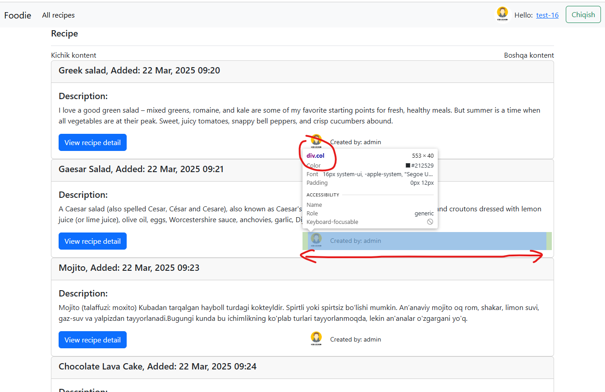
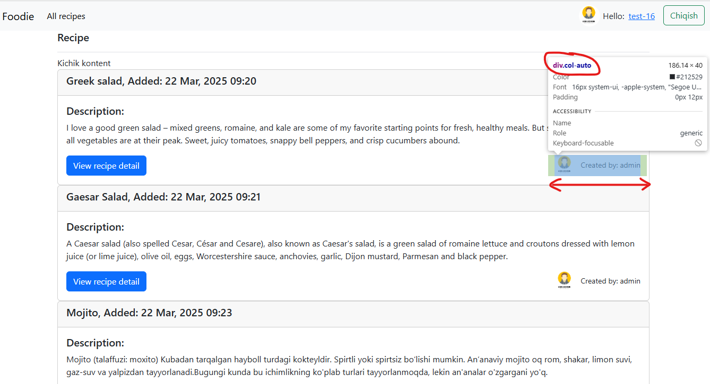

#### 1. Bootstrap da `ms-auto` va `me-auto` nima uchun ishlatilinadi?
> me-auto va ms-auto klasslari ko'pincha flexbox konteynerlarida elementlar bilan ishlaganda qo'llaniladi, ayniqsa, veb-sahifadagi turli elementlarni bir xil qatorda joylashtirish yoki joylashuvini boshqarishni xohlaganingizda. Keling, har bir case uchun misollarni ko'rib chiqaylik:

1. `me-auto` ni qo'llash holati

    **Misol:**

    Siz bir navbatda navigatsiya tugmalari va bir qidiruv maydonini joylashtirmoqdasiz. Qidiruv maydoni o'ng tarafda joylashishi kerak, shuning uchun me-auto foydalaning.
    ```html
    <nav class="d-flex justify-content-between">
        <div>Logo</div>
        <div class="me-auto">
            <button class="btn btn-primary">Bosh sahifa</button>
            <button class="btn btn-secondary">Aloqa</button>
        </div>
        <input type="text" placeholder="Qidirish" />
    </nav>
    ```
    > Bu holatda `me-auto` qidiruv maydonini o'ngga siljitadi va navigatsiya tugmalari chapda joylashadi.

2. `ms-auto` ni qo'llash holati

    **Misol:** 

    Siz bir kartada har xil ma'lumotlar ko'rsatish va ularni o'ng tomonga joylashtirishni xohlaysiz. Masalan, xarid qilish tugmasi kartaning o'ng tomonida joylashishi kerak.    

    ```html
    <div class="d-flex justify-content-between">
        <div>
            <button class="btn btn-facebook">Facebook</button>
            <button class="btn btn-twitter">Twitter</button>
        </div>
        <div class="ms-auto">
            <p>Contact: info@example.com</p>
        </div>
    </div>
    ```    
   Bu holatda ijtimoiy tarmoqlar tugmalari chapda, kontakt ma'lumotlari esa o'ngda joylashgan bo'ladi.

### 2. class="display-2" nima uchun ishlatilinadi.

> class="display-2" Bootstrapda matnni stilize qilish uchun ishlatiladigan klasslardan biridir. Bootstrapda `display-*` klasslari matnni katta va diqqatni tortadigan tarzda ko'rsatish uchun mo'ljallangan. Bu `class` yordamida matnning o'lchamini va ko'rinishini o'zgartirish mumkin.

Bootstrapda `display` klasslari to'plami mavjud:
- display-1
- display-2
- display-3
- display-4
- display-5
- display-6

### 3. `small` tegi nima uchun ishlatilinadi?

> `small` tegi `HTML` da matnni kichikroq ko'rsatish uchun ishlatiladi.

**Misol:** 
```html
<p>Bu asosiy matn. <small>Bu kichik matn.</small></p>
```
4. ``` class="col-auto"``` nima uchun kerak.

> `class="col-auto"` `Bootstrap` da ishlatiladigan klasslardan biridir. Bu klass, `Bootstrap` `grid` tizimida elementning kengligini avtomatik ravishda belgilash uchun ishlatiladi. 

- **Avtomatik kenglik:** Elementning kengligi uning ichidagi kontentga mos ravishda avtomatik ravishda o'zgaradi.
- **Flexbox bilan ishlash:** `col-auto` klassi, flexbox asosida joylashuvni ta'minlaydi, bu esa elementlarni bir-biriga yaqin joylashtirish imkonini beradi.

Ushbu code orqali `co-auto` va `col` klaslari  faqini ko'rish mumkin:

```html
 <div class="row align-items-center">
                        <div class="col">
                            <small><a href="" class="btn btn-primary">View
                                recipe detail</a></small>
                        </div>
                        <div class="col-auto">
                            
                                
                            
                        <small> Created by: {{ recipe.user.username }}</small>
                        </div>

                    </div>
```

`class="col"`:
 

`class="col-auto"`:
 

### 4. `<pre>` tegi nima uchun ishlatilinadi?

> `<pre>` tegi `HTML` da `preformatted text` (oldindan formatlangan matn) uchun ishlatiladi. Bu teg matnni brauzerda ko'rsatishdan oldin saqlanadigan formatni (masalan, bo'shliqlar, qatorlar va belgilar) saqlaydi

**Qo'llanilishi:**

`<pre>` tegi veb sahifalarda `kod`, `log fayllari` yoki rangli ma'lumotlarni formatlangan holda ko'rsatish zarurati bo'lganda juda foydalidir.


