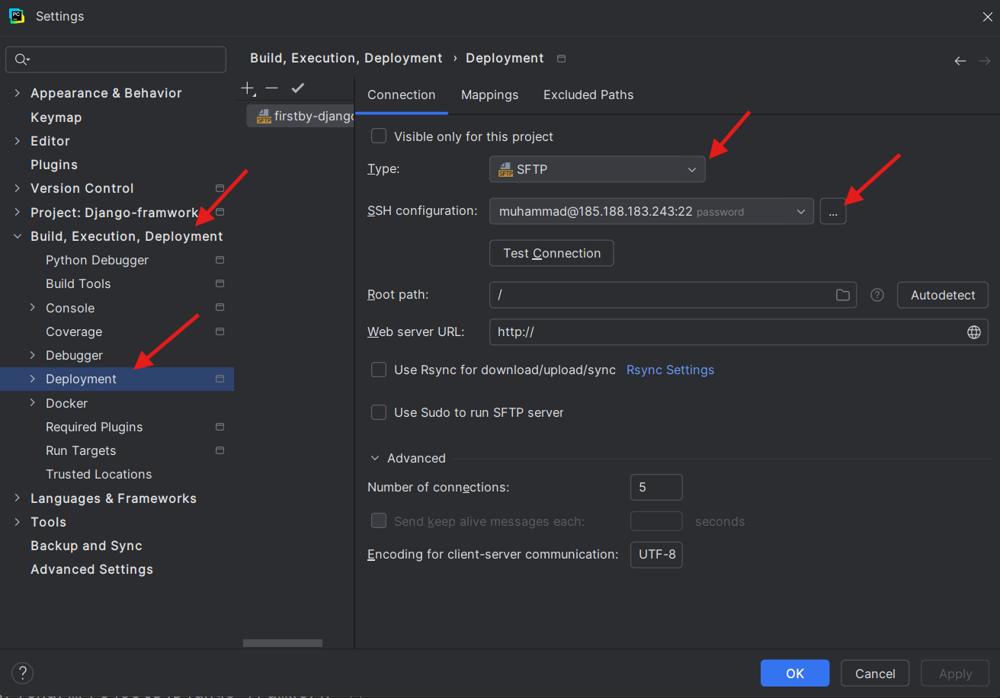

### 1. `SSH` ulanishini `PyCharm` da qanday sozlash mumkin?

1. `PyCharm` ni ochish: Dasturiy ta'minotni ishga tushiring.
2. `Preferences` yoki `Settings` oynasini ochish:
   - Windows/Linux: File -> Settings
   - "Build, Execution, Deployment" -> "Deployment" ni tanlang.
3. Yangi konfiguratsiya qo'shish
   - `+` tugmasini bosing va `SFTP` ni tanlang.
   - Yangi ulanishga nom bering (masalan, `My SSH Server`).
 
4. SSH configuration da quydagilarni blelgilang:
   - `Host`: Masofaviy serveringizning `IP` manzili yoki `domen` nomi.
   - `Port`: Standart `SFTP` porti (odatiy `22`).
   - `Root path`: Masofaviy serverda ishlashni xohlagan papkangizning yo'li.
   - `User name`: Masofaviy serverga kirish uchun foydalanuvchi nomi.
5. `Test Connection`: Ulanish parametrlarini to'g'ri kiritganingizdan so'ng, `Test Connection` tugmasini bosing. Agar barcha narsalar to'g'ri bo'lsa, `Connection successful` degan xabarni ko'rasiz.

6. `ssh` orqali serverga kirganigizda, sizni qaysi `papkaga` yo'naltirish sozlamalarini quydagicha sozlaysiz!

