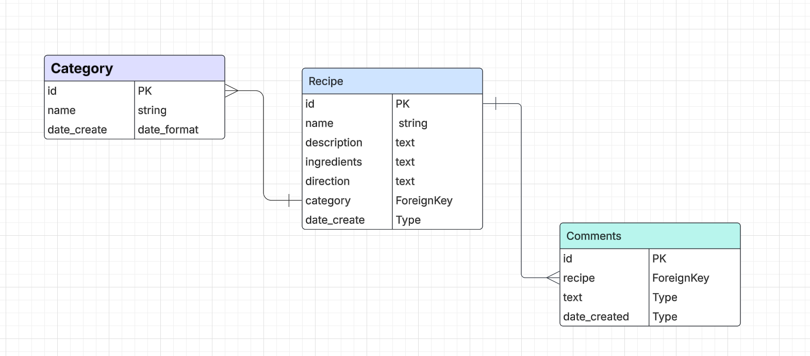
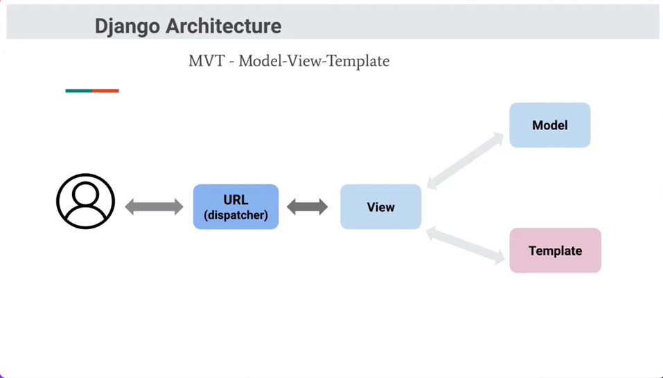
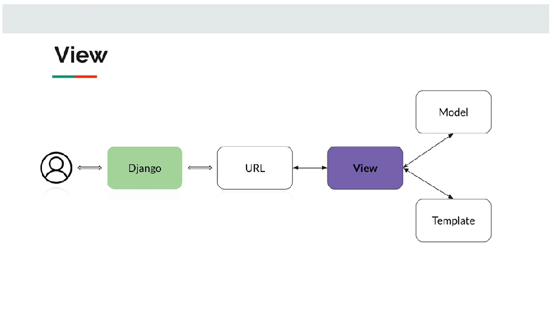
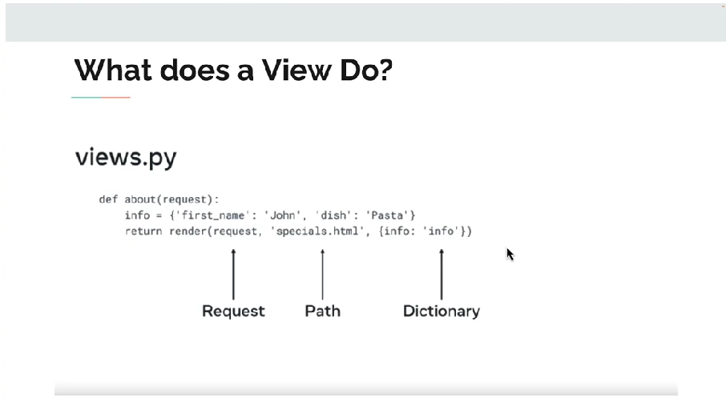

### Quyida ketirilgan misollarda ushbu SQL datatable ulanishlaridan foydalanilgan:

[sql diagram](https://lucid.app/lucidchart/0f17ca6c-8b14-4f83-9d18-bc37732c3d13/edit?viewport_loc=-897%2C-134%2C1279%2C592%2C0_0&invitationId=inv_f835fc18-8012-4850-9a28-d88e92918a33)




### 1. Framwork nima?

>__Framework__ - bu dasturchilar uchun ilovalarni tez va samarali qurish imkonini beruvchi asboblar to'plamidir. 

<ul>
  <li> <b>Asboblar:</b> Dasturchilar uchun foydali bo'lgan dasturiy ta'minot vositalari.</li>
  <li> <b>Kutubxonalar:</b> Dasturchilar tomonidan tez-tez ishlatiladigan kodlar to'plami.</li>
  <li> <b>Konvensiyalar:</b> Dasturlash jarayonida qo'llaniladigan qoidalar va standartlar</li>
</ul>

### 2. Django nima?

>__Django__ - bu veb-ilovalarni tez va samarali yaratish uchun mo'ljallangan Python asosidagi veb frameworkdir. 
 
<ul>
  <li> <b>Tez rivojlanish:</b> Django dasturchilarga ilovalarni tezda yaratishga yordam beradi.</li>
  <li> <b>Xavfsizlik:</b> Django xavfsizlikni ta'minlash uchun ko'plab o'rnatilgan funksiyalarni taklif etadi..</li>
  <li> <b>Kengaytirilgan imkoniyatlar:</b> Django ORM (Object-Relational Mapping) orqali ma'lumotlar bazasi bilan oson ishlash imkonini beradi</li>
</ul>

### 3. HTTP(Hypertext Transfer Protocol) nima?

>vebda ma'lumotlarni uzatish uchun ishlatiladigan protokol.

<ul>
  <li> <b>GET:</b> Ma'lumot olish.</li>
  <li> <b>POST:</b> Ma'lumot yuborish</li>
  <li> <b>PUT:</b> Ma'lumotni yangilash.</li>
  <li> <b>DELETE:</b> Ma'lumotni o'chirish..</li>
</ul>

### 4. FTP (File Transfer Protocol) nima?

>Bu fayllarni tarmoq orqali uzatish uchun ishlatiladigan protokol. FTP yordamida foydalanuvchilar fayllarni serverga yuklash yoki serverdan yuklab olish imkoniyatiga ega.

### 5. IDE (Integrated Development Environment) nima?

>Environment) - bu dasturchilar uchun mo'ljallangan dasturiy ta'minot bo'lib, u kod yozish, tahrirlash, sinovdan o'tkazish va dasturlarni ishlab chiqish jarayonini osonlashtiradi. IDE quyidagi asosiy komponentlarga ega

<ul>
  <li> <b>Kod tahrirlovchi:</b> Kodni yozish va tahrirlash uchun qulay interfeys.</li>
  <li> <b>Konsol:</b> Dastur natijalarini ko'rish uchun.</li>
  <li> <b>Debugger:</b> Dasturdagi xatolarni aniqlash va tuzatish uchun.</li>
  <li> <b>Versiya nazorati:</b> Kodning turli versiyalarini boshqarish imkoniyati.</li>
</ul>

### 6. Loyihada muhit o'zgauchisi qanday buyruq yordamida o'rtantiladi?

> python3 -m venv venv


### 7. Venv qanday activlashtiriladi(Windows va Mac)?

```/venv/Scripts/activate | source/venv/bin/activate```

### 8. Django framowork o'rnatish buyrug'i?

```pip install django```

### 9. Djangoda loyihasini yaratish uchun qanday buyruqdan foydalanasiz?

```django-admin startproject project_name```

### 10. ```django-admin startproject project_name``` va ```django-admin startproject project_name .``` buyruqlarining farqi

<ul>
  <li> Agar siz <b>.</b> ni qo'shsangiz, loyiha joriy papkaga yaratiladi. </li>
  <li> Agar siz <b>.</b> ni qo'shmasangiz, yangi papka yaratiladi va loyiha shu papkada joylashadi. </li>
</ul>

### 11. setting.py ichida INSTALLED_APPS nima uchun kerak?
> Loyihangizda ishlatiladigan ilovalarni __(apps)__ ro'yxatini belgilaydi.

### 12. MIDDLEWARE nima uchun kerak?

>Django'da __HTTP__ so'rovlarini va javoblarini boshqarish uchun ishlatiladigan komponentlar to'plami.

<ul>
    <li> <b>Middleware</b> so'rovlar va javoblar ustida ishlash imkonini beradi, masalan, so'rovlarni autentifikatsiya qilish yoki javoblarni formatlash.</li>
    <li> <b>Middleware</b> xavfsizlikni ta'minlash uchun ishlatilishi mumkin, masalan, <b>Cross-Site Request Forgery (CSRF)</b> himoyasi yoki <b>XSS (Cross-Site Scripting)</b> hujumlariga qarshi himoya.</li>
    <li> <b>Middleware</b> sessiyalarni va cookie fayllarini boshqarish imkonini beradi, bu esa foydalanuvchi ma'lumotlarini saqlashda yordam beradi</li>
</ul>  

### 13. ROOT_URLCONF nima uchun kerak?

>__Django__ da URL marshrutizatsiyasini boshqarish uchun ishlatiladigan parametr. 

### 14. TEMPLATES nima uchun kerak?

>__Django__ da HTML shablonlarini boshqarish uchun ishlatiladigan parametr. 

### 15. ```sgi.py``` va ```vsgi.py``` nima uchun kerak?

> Django ilovalarini serverga joylashtirishda ishlatiladigan fayllar.

<ul>
    <li> <b>ASGI (Asynchronous Server Gateway Interface)</b> fayli asinxron ilovalar uchun mo'ljallangan. Bu, Django ilovalarining asinxron xususiyatlarini qo'llab-quvvatlash imkonini beradi, masalan, <b>WebSocketlar</b> va boshqa asinxron protokollar.</li>
    <li> <b>WSGI (Web Server Gateway Interface)</b> fayli asinxron bo'lmagan ilovalar uchun mo'ljallangan. Bu, <b>Django</b> ilovalarini an'anaviy <b>HTTP</b> serverlar bilan bog'lash imkonini beradi.</li>
</ul>  

### 16. ```urls.py``` nima uchun kerak?

>__Django__ ilovasida __URL__ marshrutizatsiyasini boshqarish uchun ishlatiladigan fayl. 


### 17. ```manage.py``` nima uchun kerak?

>__Django__ ilovalarini boshqarish uchun ishlatiladigan muhim fayl

### 18. Djangoda app nima uchun kerka?

>Loyiha ichida ma'lum bir vazifani bajaradigan mustaqil moduldir. __Django arxitekturasida__, bir loyiha bir nechta ilovalarni o'z ichiga olishi mumkin

<ul>
    <li> <b>Modularlik</b> Har bir app o'z vazifasini bajaradi, bu esa kodni tartibga solishga yordam beradi.</li>
    <li> <b>Qayta foydalanish</b> Bir app boshqa loyihalarda ham ishlatilishi mumkin, bu esa kodni qayta ishlatishni osonlashtiradi</li>
    <li> <b>Kengaytirilish</b> Loyiha o'sgan sari yangi app'lar qo'shish mumkin, bu esa loyihani kengaytirishni osonlashtiradi.</li>
</ul>  

### 19. Django da yangi app yaratish uchun qanday buyruqdan foydalanasiz?

 ```python manage.py startapp app_nomi```

### 20. app  ichidagi admin.py nim uchun kerak

>__Admin__ interfeysini boshqarish uchun ishlatiladi. Bu faylda siz o'z __app__ ingizdagi modellarning admin panelda qanday ko'rsatilishini belgilaysiz. 

### 21. app  ichidagi views.py nim uchun kerak?

> __Web__ ilovangizning biznes logikasini va foydalanuvchi so'rovlariga qanday javob berilishini belgilaydi. Bu faylda siz foydalanuvchilarga ko'rsatiladigan ma'lumotlarni tayyorlaysiz va ularni __HTML__ shablonlariga uzatasiz

### 22. app  ichidagi urls.py nim uchun kerak?

> Bu faylda siz foydalanuvchilarning so'rovlarini qaysi __view funksiya__ siga yo'naltirishni belgilaysiz.


### 23. Asosiy ```urls.py``` ichidagi ```from django.urls import include``` nima uchun kerak?

>Asosiy ```urls.py``` faylida __include__ funksiyasini ishlatib, __app__ ining __URL__ larini qo'shishingiz mumkin.

### 24. ```app``` ichidagi ```views.py``` modulidagi ```from django.shortcuts import render``` nima uchn kerak?

> __HTML__ shablonlarini render qilish uchun ishlatiladi. Bu funksiya, ma'lumotlarni __HTML__ shabloniga uzatish va foydalanuvchiga ko'rsatish jarayonini osonlashtiradi.

<ul>
    <li> Siz belgilangan shablonni yuklab olasiz. </li>
    <li> Siz shablonga ma'lumotlarni uzatishingiz mumkin, bu esa foydalanuvchiga ko'rsatiladigan dinamik kontentni yaratadi. </li>
    <li> <b>render</b> funksiyasi avtomatik ravishda <b>HTTP</b> javobini yaratadi va uni qaytaradi.</li>
</ul> 

```python
from django.shortcuts import render

def index(request):
    context = {
        'message': 'Salom, Dunyo!'
    }
    return render(request, 'index.html', context)
```

### 25. ```request``` nima uchun kerak?

<ul>
    <li> Siz foydalanuvchining yuborgan ma'lumotlarini, masalan, formalar yoki URL parametrlarini olish uchun request obyektidan foydalanasiz. </li>
    <li> So'rovning qaysi HTTP metodidan (GET, POST, va hokazo) foydalanayotganini aniqlashingiz mumkin. </li>
    <li> Siz foydalanuvchi sessiyasi va cookie ma'lumotlariga kirishingiz mumkin.</li>
</ul> 

```python
from django.http import HttpResponse
from django.shortcuts import render
def index(request):
    if request.method == 'POST':
        user_input = request.POST.get('input_field')
        return HttpResponse(f"Siz kiritgan ma'lumot: {user_input}")
    return render(request, 'index.html')
```
```python
{
    'method': 'GET',  # So'rovning HTTP metodi (GET, POST, va hokazo)
    'path': '/sandbox/',  # So'rov qilingan URL yo'li
    'GET': {            # URL parametrlarini o'z ichiga oladi
        'param1': 'value1',
        'param2': 'value2',
    },
    'POST': {           # Form ma'lumotlarini o'z ichiga oladi
        'input_field': 'user_input_value',
    },
    'COOKIES': {        # Foydalanuvchi cookie ma'lumotlari
        'cookie_name': 'cookie_value',
    },
    'session': {        # Foydalanuvchi sessiya ma'lumotlari
        'session_key': 'session_value',
    },
    'user': <User object>,  # Foydalanuvchi obyekti (agar autentifikatsiya qilingan bo'lsa)
    'is_ajax': False,  # So'rov AJAX orqali yuborilganmi yoki yo'q
    'headers': {        # So'rov sarlavhalari
        'User-Agent': 'Mozilla/5.0',
        'Content-Type': 'application/json',
    },
}
```

### 26. from django.http import HttpResponse nima uchun kerak?

>```HTTP``` javoblarini yaratish uchun ishlatiladi. Bu funksiya, serverdan foydalanuvchiga ma'lumotlarni yuborish jarayonini osonlashtiradi.


<ul>
    <li> <b>Javob yaratish:</b>  Siz foydalanuvchiga yuboriladigan HTTP javobini yaratishingiz mumkin. Bu javob, HTML, JSON, yoki boshqa formatlarda bo'lishi mumkin. </li>
    <li> <b>Kontentni belgilash:</b> Siz javobning kontentini va uning turini (masalan, text/html, application/json) belgilashingiz mumkin.</li>
    <li> <b>Status kodini belgilash: </b> Siz javobning HTTP status kodini (masalan, 200, 404, 500) belgilashingiz mumkin.</li>
</ul>  

```python
from django.http import HttpResponse

def index(request):
    return HttpResponse("Salom, Dunyo!", status=201)  # 201 Created
```

### 27. MVT (Model-View-Template) nima va nima uchun kerak?

> __Django__ da web ilovalarini yaratish uchun ishlatiladigan arxitektura tamoyilidir. 

<ul>
    <li> <b>Model:</b>Model ma'lumotlar tuzilishini belgilaydi. Bu yerda siz ma'lumotlar bazasida qanday ma'lumotlar saqlanadi va ularning qanday bog'lanishi kerakligini aniqlaysiz.  Model yordamida siz ma'lumotlar bazasiga so'rovlar yuborishingiz va ma'lumotlarni olish yoki saqlashingiz mumkin. Django ORM (Object-Relational Mapping) orqali bu jarayonni osonlashtiradi. </li>
    <li> <b>View:</b> Bu yerda siz ilovangizning biznes mantiqini belgilaysiz. Foydalanuvchidan kelgan so'rovni qabul qiladi, kerakli ma'lumotlarni modeldan oladi va bu ma'lumotlarni shablonga uzatadi. Views da foydalanuvchiga ko'rsatiladigan ma'lumotlarni tayyorlaydi.</li>
    <li> <b>Template:</b> Shablon foydalanuvchiga ko'rsatiladigan ma'lumotlarni taqdim etadi. Views tomonidan uzatilgan ma'lumotlar shablon ichida ko'rsatiladi. </li>
</ul>  

### 28. MVT jarayoni ketma-ketligi qanday amalga oshiriladi

<ul>
    <li> <b>Foydalanuvchi so'rovi:</b> Foydalanuvchi brauzerda URL manzilini kiritadi.</li>
    <li> <b>URL Dispatcher:</b> Django URL dispatcher'i so'rovni qabul qiladi va mos keladigan vista'ni aniqlaydi.</li>
    <li> <b>Views:</b> Views modeldan ma'lumotlarni oladi va shablonni tanlaydi.</li>
    <li> <b>Model: </b> Model ma'lumotlar bazasidan kerakli ma'lumotlarni olish uchun ishlatiladi.</li>
    <li> <b>Taplate:</b> Shablon ma'lumotlarni ko'rsatish uchun tayyorlanadi.</li>
    <li> <b>Respose: </b> Tayyorlangan HTML foydalanuvchiga qaytariladi.</li>
</ul>



### 29. `choise()` funksiyasi nima vazifani bajardi?

> `choice()` funksiyasi Python dasturlash tilida tasodifiy elementni tanlash uchun ishlatiladi. Bu funksiya random modulidan keladi va berilgan ro'yxatdan (yoki ketma-ketlikdan) tasodifiy bir elementni qaytaradi.
```python
from random import choice
fruits = ['olma', 'banan', 'mango', 'apelsin']
random_fruit = choice(fruits)
print(random_fruit)
```
### 30. URL dispatcher nima uchun kerak?

> Bu __veb-ilovalar__ uchun muhim komponent bo'lib, u foydalanuvchi so'rovlarini qabul qiladi va ularni to'g'ri ko'rinishga __(view)__ yo'naltiradi. 

```python
from django.urls import path
from . import views

urlpatterns = [
    path('', views.home, name='home'),
    path('about/', views.about, name='about'),
]
```

### 31. Djangoda  `wievs.py` nima uchun kerak?

> __Django__ da `views.py` fayli muhim rol o'ynaydi, chunki u ma'lumotlarni ko'rsatish va mijoz so'rovlariga javob berish uchun zarur bo'lgan logikani o'z ichiga oladi. views.py faylida quyidagi asosiy vazifalar bajariladi:

<ul>
    <li> <b>So'rovlarni qabul qilish:</b> Mijozdan kelgan so'rovlarni qabul qiladi.</li>
    <li> <b>Ma'lumotlarni olish:</b> Agar kerak bo'lsa, ma'lumotlarni modeldan olish uchun bog'lanadi.</li>
    <li> <b>Javobni tayyorlash:</b> Olingan ma'lumotlarni shablon (template) bilan birlashtirib, foydalanuvchiga ko'rsatish uchun tayyorlaydi.</li>
    <li> <b>Javobni yuborish:</b>  Tayyorlangan javobni foydalanuvchiga qaytaradi.</li>
</ul>  

> Bu jarayon Django'ning __Model-View-Template (MVT) arxitekturasining__ bir qismi sifatida ishlaydi. 





### 32. DTL nima ?

> Bu __Django__ web ramkasida dinamik ma'lumotlarni ko'rsatish uchun ishlatiladigan shablon tilidir. __DTL__ yordamida __HTML__ shablonlarida o'zgaruvchilar va __Teg__ lar yaratish mumkin. 

### 33. `Teg` lar deb nimaga aytiladi? 

> Teglar (tags) __DTL (Django Template Language)__ da ma'lum bir funktsiyani bajarish uchun ishlatiladigan buyruqlardir. Ular shablon ichida dinamik mantiqiy operatsiyalarni amalga oshirishga yordam beradi. Teglar, odatda, `` qavslar ichida yoziladi. 
 
### Misol uchun:
1. Shartli ifoda (if tag):

```python

    <p>Salom, {{ user.username }}!</p>

    <p>Salom, mehmon!</p>

```
2. Sikl (for tag):

```python
<ul>
    
        <li>{{ item }}</li>
    
</ul>
```
3. Blok (block tag):

```python

    <h1>Bu asosiy kontent</h1>

```

### 34. `backticks`  nima ?
>  (`) - bu kodni formatlash uchun ishlatiladigan maxsus belgilardir.

### 35. Django loyhasida standart papkalar struktusi qanday bo'ladi?

```
myproject/
│
├── myapp/                  # Django ilovasi (app)
│   ├── migrations/         # Ma'lumotlar bazasi migratsiyalari
│   ├── templates/          # Shablonlar
│   │   └── myapp/         # Ilovaga tegishli shablonlar
│   ├── static/             # Statik fayllar (CSS, JavaScript, rasmlar)
│   ├── __init__.py
│   ├── admin.py            # Admin interfeysi konfiguratsiyasi
│   ├── apps.py             # Ilova konfiguratsiyasi
│   ├── models.py           # Ma'lumotlar bazasi modellari
│   ├── tests.py            # Testlar
│   └── views.py            # Ko'rinishlar (views)
│
├── myproject/              # Loyihaning asosiy papkasi
│   ├── __init__.py
│   ├── settings.py         # Loyihaning sozlamalari
│   ├── urls.py             # URL marshrutlari
│   └── wsgi.py             # WSGI interfeysi
│
├── manage.py                # Loyihani boshqarish uchun skript
│
└── requirements.txt         # Loyihada foydalaniladigan kutubxonalar ro'yxati
```

### 36. `Django` da shablon orqali ma'lumotlarni o'tkazish qanday amalga oshiriladi? 

### `views.py`
```python
from django.shortcuts import render

def my_view(request):
    data = {
    'name': 'Paulo',
    'age': 123
}

    return render(request, 'index.html', {"data_test":data})
```
####  Ushbu shakilda ma'lumot berish standart. Bu yerda `return render(request, 'index.html', {"data_test":data})` ning juda muhim joyi bor ya'ni `{"data_test":data}` bu standart, shunday yozish orqali yartailga ma'lumotlarni `data_test` ga o'rab keyin shablonga uzatamiz.
#### `index.html`
```html
<h1>Salom, {{ data_test.name }}</h1>
<p>Yoshingiz {{ data_test.age }}.</p>
```

### 37. Asosiy `base.html` shablonni yaratish va uni kengaytirish djangoda, bu qanday amalga oshiriladi batafsil ko'rsating.

1. `base.html` fayli __Django__ loyihasining shablonlar `(templates)` papkasida joylashishi kerak.
```
myproject/
│
├── myapp/
│   ├── migrations/
│   ├── templates/
│   │   └── myapp/
│   │       └── base.html
│   ├── __init__.py
│   ├── admin.py
│   ├── apps.py
│   ├── models.py
│   ├── tests.py
│   └── views.py
│
├── myproject/
│   ├── __init__.py
│   ├── settings.py
│   ├── urls.py
│   └── wsgi.py
│
└── manage.py
```
2. ``: Asosiy shablonda, boshqa shablonlar ushbu blokni kengaytirishi uchun joy ajratish kerak. 

`base.html`

```html
<!DOCTYPE html>
<html lang="en">
<head>
    <title>Asosiy Shablon</title>
</head>
<body>
    <div class="container">
        
        
    </div>
</body>
</html>
```
3. `base.html` aosida yangi `index.html` ni yaratamiz.

> Yaratish sintaksisi: `index.html` faylida quyidagi kodni qo'shing:

`index.html`

```html



    <h1>Salom, Django!</h1>
    <p>Bu mening birinchi sahifam.</p>

```

### 38. `Django` da modellari va ma'lumotlar bazalari haqida nimalar bilasiz?

> `Django` da modellar ma'lumotlarni qanday saqlash va boshqarish uchun ishlatiladi. Ular ma'lumotlar bazasidagi jadvallarni ifodalaydi va ma'lumotlar bilan ishlashni osonlashtiradi.
- `Model`: __Django__ da har bir model bir sinf sifatida yaratiladi va bu sinf ma'lumotlar bazasidagi jadvalni ifodalaydi.
- `ORM` (Object-Relational Mapping): `Django` `ORM` ma'lumotlar bazasi bilan ishlashni osonlashtiradi, bu orqali `SQL` so'rovlarini yozmasdan ma'lumotlarni qo'shish, o'chirish va yangilash mumkin.

### 39. `django` da yangi `app` ichidagi `urls.py` ichida `app_name` nima uchun kerak?

> `Django` da `urls.py` faylida `app_name` ni belgilashning maqsadi, `URL` nomlarini o'zaro farqlash va `namespacing` (nomlar maydoni) yaratishdir. Bu, bir nechta ilovalar `(apps)` bo'lgan loyihalarda `URL` larni boshqarishni osonlashtiradi. 

- `Nomlar to'qnashuvini oldini olish:` Agar bir xil nomli `URL` lar bo'lsa, `app_name` yordamida ularni farqlash mumkin.
- 
- __`URL` larni chaqirishda qulaylik:__ `app_name` yordamida `URL` larni chaqirishda to'g'ri ilovaga murojaat qilish osonlashadi.

#### Misol uchun:

> Agar sizda `blog` va `shop` ilovalari bo'lsa, har birining `urls.py` faylida `app_name` ni belgilash orqali, siz `blog:index` va `shop:index` kabi `URL` larni chaqirishingiz mumkin.

` Blog ilovasi` da  `urls.py` faylida `app_name` ni belgilash:

```python
# blog/urls.py
from django.urls import path
from . import views

app_name = 'blog'

urlpatterns = [
    path('', views.index, name='index'),
    path('post/<int:post_id>/', views.detail, name='detail'),
]
```

`Shop ilovasi` da `urls.py` faylida `app_name` ni belgilash:

```python
# shop/urls.py
from django.urls import path
from . import views

app_name = 'shop'

urlpatterns = [
    path('', views.index, name='index'),
    path('product/<int:product_id>/', views.detail, name='detail'),
]
```
Endi, agar siz `blog` ilovasidagi `index` `URL` ni chaqirmoqchi bo'lsangiz, siz quyidagicha yozasiz:

```html
# templates/blog/index.html
<a href="">Blog Bosh Sahifasi</a>
```
Agar `shop` ilovasidagi `index` `URL` ni chaqirmoqchi bo'lsangiz, siz quyidagicha yozasiz.

```html
# templates/shop/index.html
<a href="">Do'kon Bosh Sahifasi</a>
```
> `` ushbu sintaksisni yozganda etiborli bo'ling `'shop:index'` ichida  ortiqcha probel bo'lmasligi kerak aks holda quydagi hatolik bo'lishi mumkin:
```html
Exception Value:	
Reverse for 'index ' not found. 'index ' is not a valid view function or pattern name.
```

### 40. `Django` da `Shablonlar(templates)` katalogini loyiha darajasida qayta tashkil etish?

- Loyihangizning asosiy papkasida yangi `templates` papkasini yarating. Ushbu papkada umumiy shablonlar, masalan, `base.html` faylini joylashtiring.

- Django loyihangizning `settings.py` faylida shablonlar katalogini ko'rsatishingiz kerak. Buning uchun `TEMPLATES` bo'limida `DIRS` ro'yxatiga yangi shablonlar papkasini qo'shing.

`settings.py`

```python
import os

BASE_DIR = os.path.dirname(os.path.dirname(os.path.abspath(__file__)))

TEMPLATES = [
    {
        'BACKEND': 'django.template.backends.django.DjangoTemplates',
        'DIRS': [os.path.join(BASE_DIR, 'templates')],
        'APP_DIRS': True,
        'OPTIONS': {
            'context_processors': [
                'django.template.context_processors.debug',
                'django.template.context_processors.request',
                'django.contrib.auth.context_processors.auth',
                'django.contrib.messages.context_processors.messages',
            ],
        },
    },
]
```

### 41. `Django` dagi `migrations` lar haqida nima bilasiz?

>  `Migrations` — bu ma'lumotlar bazasi sxemasini modellarga moslashtirish uchun ishlatiladigan mexanizmdir. 

- `Ta'rif`: `Migrations` — bu `Django` ilovangizning ma'lumotlar bazasi sxemasidagi o'zgarishlarni kuzatib boradigan fayllardir. Ushbu fayllar ma'lumotlar bazasi jadvallarini yaratish, yangilash yoki o'chirish kabi jarayonlarni o'z ichiga oladi.
- `Migrations papkasi`: Har bir `Django` ilovasi yaratilganda, avtomatik ravishda migrations papkasi yaratiladi. Ushbu papka, ilovangizning ma'lumotlar bazasi o'zgarishlarini o'z ichiga olgan `migration` fayllarini saqlaydi.
- `Qo'llash`: `Migrations` ni qo'llash uchun terminalda `python manage.py migrate` buyrug'ini ishlatasiz. Ushbu buyruq, barcha `migration` fayllarini bajarib, ma'lumotlar bazangizni yangilaydi.

### 42. `Migratsiya` fayllari qanday yaratiladi?

> `Django` da `migratsiya` fayllarini yaratish uchun quyidagi qadamlarni bajarishingiz kerak:

1. `Modelni yaratish`: Avval, `Django` ilovangizda modelni aniqlang. `Model` — bu ma'lumotlar bazasidagi jadvalni ifodalovchi `Python` klassidir.
2.  `Migratsiya yaratish`: `Modelni` yaratgandan so'ng, terminalda quyidagi buyruqni bajarishingiz kerak: `python manage.py makemigrations` Bu buyruq, `Django` ga modeldagi o'zgarishlarni aniqlash va ularga mos keladigan migratsiya faylini yaratish uchun ko'rsatma beradi.
3. `Migratsiya` faylini tekshirish: `makemigrations` buyrug'ini bajarganingizdan so'ng, `migrations` papkasida yangi migratsiya fayli paydo bo'ladi. Ushbu fayl, modeldagi o'zgarishlarni aks ettiradi.
4. `Migratsiyani qo'llash`: Yaratilgan migratsiya faylini ma'lumotlar bazasiga qo'llash uchun quyidagi buyruqni bajarishingiz kerak: `python manage.py migrate`

### 43. `python manage.py shell`  buyrug'i nima uchun ishlatilinadi?

> Bu buyruq `Django` loyihangizning interaktiv `Python shell` ini ochadi, bu orqali siz `Django` modellariga va ma'lumotlar bazasiga murojaat qilishingiz mumkin. 

`Django shell`ida qilishingiz mumkin bo'lgan ba'zi ishlar:

- `Ma'lumotlar bazasini so'rov qilish`: `Modellarni` import qilib, ma'lumotlar bazasidan ma'lumotlarni olish yoki o'zgartirish uchun so'rovlar yuborishingiz mumkin.
- `Obyektlar yaratish`: `Modellarni` yangi `instansiyalarini` yaratib, ularni ma'lumotlar bazasiga saqlashingiz mumkin."`Instansiya(obyekt)`  `modelga` mos keladigan ma'lumotlar to'plamini ifodalaydi. Masalan, agar sizda "Kategoriyalar" modeli bo'lsa, unda har bir kategoriya (masalan, "Desert" yoki "Salat") `modelning` bir `instansiya`si hisoblanadi. Umman olganda `instansiya` bu `obyekt` desak ham bo'ladi"
- Kod qismlarini sinab ko'rish: `Python` kodini bajarib, funksiyalarni sinab ko'rish yoki muammolarni hal qilish uchun foydalanishingiz mumkin.

### 44. `Category.objects.all()` ushbu buyruq nima vazifani bajaradi?

> `Django ORM (Object-Relational Mapping)` da ishlatiladigan bir buyruqdir. Bu buyruq, `Category modeli` orqali ma'lumotlar bazasidagi barcha kategoriya obyektlarini olish uchun ishlatiladi.

`Tushuntirish:`
- `Category`: Bu sizning `Django` modelingiz. Masalan, agar sizda `Kategoriyalar` nomli model bo'lsa, u `Category` deb ataladi.
- `objects`: Bu `Django` modelining standart manageridir. U orqali siz ma'lumotlar bazasidagi obyektlar bilan ishlashingiz mumkin. `objects` manageri yordamida siz ma'lumotlarni __olish__, __yaratish__, __yangilash__ va __o'chirish__ kabi operatsiyalarni bajarishingiz mumkin.
- `all()`: Bu metod, ma'lumotlar bazasidagi barcha obyektlarni olish uchun ishlatiladi.

> `Obyekt yartaishi`: `cat = Category.objects.create(name="Paulo")`

### 45. `Django` loyihasida super user yaratish  buyruqi qanday?

> `python manage.py createsuperuser` ushbu buyruq kiritilgandan keyin `username`, `mail` va `password` kiritasiz. `User` yartailgandan so'ng `http://127.0.0.1:8000/admin` manzilig o'ting.

### 46.  `Django` app ichidagi `admin.py` ichidagi `admin.site.register()` funksiyasi qanday vazifani bajaradi?

> `Modelni ro'yxatdan o'tkazish`: `admin.site.register()` funksiyasi yordamida siz `Django admin` panelida ko'rsatmoqchi bo'lgan modelni ro'yxatdan o'tkazasiz. Bu `model` sizning ma'lumotlar bazangizda mavjud bo'lgan ma'lumotlarni ifodalaydi.
> `Admin` interfeysini yaratish: `Model`  ro'yxatdan o'tgach, `admin` panelida ushbu `modelga` tegishli bo'lgan barcha ma'lumotlarni `ko'rish`, `qo'shish`, `o'zgartirish` va `o'chirish` imkoniyatiga ega bo'lasiz. Bu, masalan, yangi kategoriya qo'shish yoki mavjud kategoriyalarni tahrirlash uchun qulay interfeysni taqdim etadi.
>  Misol uchun, agar siz  `modelni` ro'yxatdan o'tkazmasangiz, `admin` panelida ushbu `modelga` oid ma'lumotlarni `ko'rish` yoki `boshqarish` imkoniyatingiz bo'lmaydi.

### 47. `timezone.now()`  funksiyani tushuntiring?

> `timezone.now()` funksiyasi  hozirgi vaqtini qaytaradi. Format: `2023-10-05 14:30:45+00:00`

### 48. `Administrator` interfeysini sozlash va `modellarda` koʻproq maydonlarni koʻrsatish.

> `ModelAdmin` klassidan foydalanishingiz mumkin. Quyidagi qadamlar orqali buni amalga oshirishingiz mumkin:

1. `ModelAdmin klassini yaratish`: Siz `ModelAdmin` `class` idan meros olgan yangi `class` yaratasiz.
```python
from django.contrib import admin
from .models import Category

class CategoryAdmin(admin.ModelAdmin):
    list_display = ('id', 'name', 'date_added')  # Ko'rsatmoqchi bo'lgan maydonlar
```
2. `Modelni` ro'yxatdan o'tkazish: Yangi `CategoryAdmin` `class` ini o'z modelingiz bilan ro'yxatdan o'tkazing.
```python
admin.site.register(Category, CategoryAdmin)
```

### 49. `Django` da `admin` interfeysini boshqarish uchun ishlatiladi. Keling, uning ba'zi muhim xususiyatlarini ko'rib chiqamiz:

1. `list_display`: Bu xususiyat `admin` panelida ko'rsatiladigan maydonlarni belgilaydi. `id`, `name`, va `date_added` maydonlari `admin` panelida ko'rsatiladi.

`app/admin.py`

```python
class CategoryAdmin(admin.ModelAdmin):
    list_display = ('id', 'name', 'date_added')
```

2. `list_filter`: Bu xususiyat admin interfeysida filtrlar qo'shish imkonini beradi. Foydalanuvchilar `date_added` bo'yicha `filtrlar` qo'shishlari mumkin.

`app/admin.py`

```python
class CategoryAdmin(admin.ModelAdmin):
    list_filter = ('date_added',)
```

3. `search_fields`: Bu xususiyat qidiruv maydonlarini belgilaydi. Foydalanuvchilar `name` maydoni bo'yicha qidiruv o'tkazishlari mumkin.

`app/admin.py`

```python
class CategoryAdmin(admin.ModelAdmin):
    search_fields = ('name',)
```
4.  `actions`: Bu xususiyat `admin` interfeysida bajarilishi mumkin bo'lgan harakatlar ro'yxatini belgilaydi. Foydalanuvchilar bir nechta kategoriyalarni tanlab, ularni `featured` deb belgilashlari mumkin.

`app/admin.py`

```python
class CategoryAdmin(admin.ModelAdmin):
    actions = ['mark_as_featured']

    def mark_as_featured(self, request, queryset):
        queryset.update(is_featured=True)
```
5. `inlines`: Bu xususiyat boshqa modellarga bog'langan ma'lumotlarni ko'rsatish uchun ishlatiladi. `Category` modeliga bog'langan `Item` yozuvlarini ko'rsatish imkonini beradi.

```python
class ItemInline(admin.TabularInline):
    model = Item
    extra = 1

class CategoryAdmin(admin.ModelAdmin):
    inlines = [ItemInline]
```

### 50. `on_delete=models.CASCADE` qayerda va nima uchun ishlatilinadi?

> `Django` da `ForeignKey` maydonida ishlatiladigan parametrdir. Bu parametr, bog'langan ob'ekt (masalan, `Category modeli`) o'chirilganda, unga bog'langan barcha ob'ektlar (masalan, `Recipe modeli`) ham avtomatik ravishda o'chirilishini ta'minlaydi.

`Misol uchun:`

> Agar sizda `Desserts` nomli kategoriya bo'lsa va bu kategoriya ostida `Chocolate Cake` va `Ice Cream` retseptlari bo'lsa, `Desserts` kategoriya o'chirilganda, `Chocolate Cake` va `Ice Cream` retseptlari ham o'chiriladi.

### 51.  `Django QuerySet API` haqia nimalar bilasiz?

> `Django ORM (Object-Relational Mapping)` orqali ma'lumotlar bazasidan ma'lumotlarni olish va `manipulyatsiya` qilish uchun ishlatiladigan kuchli vositadir. Quyida asosiy tushunchalar keltirilgan:

- Bu ma'lumotlar bazasidagi so'rovlar to'plamidir. `QuerySetlar` `lazy evaluation` (sekin baholash) tamoyiliga asoslangan, ya'ni ma'lumotlar bazasidan ma'lumotlar faqat kerak bo'lganda olinadi.

`Asosiy metodlar`

1. `all()`: Barcha ob'ektlarni olish uchun ishlatiladi: 
    
    > Misol: "vegetarian" bo'lgan retseptlarni olish. `recipes = Recipe.objects.all()`


2. `filter()`: Berilgan shartlarga mos keladigan ob'ektlarni olish uchun ishlatiladi. 

    >Misol: "vegetarian" bo'lmagan retseptlarni olish.`vegetarian_recipes = Recipe.objects.filter(is_vegetarian=True)`
    

3. `exclude()`: Berilgan shartlarga mos kelmaydigan ob'ektlarni olish uchun ishlatiladi. 

    > Misol: "vegetarian" bo'lmagan retseptlarni olish. `non_vegetarian_recipes = Recipe.objects.exclude(is_vegetarian=True)`


4. `get()`: Berilgan shartlarga mos keladigan bitta ob'ektni olish uchun ishlatiladi. 

    > Misol: IDsi 1 bo'lgan retseptni olish. `recipe = Recipe.objects.get(id=1)`

5. `first()`: Birinchi ob'ektni olish. 

    > `recipe = Recipe.objects.get(id=1)`

6. `last():` Oxirgi ob'ektni olish. 

    >`last_recipe = Recipe.objects.all().last()`

7. `order_by()`: Natijalarni tartiblash. Misol: Retseptlarni nomi bo'yicha tartiblash. 

    > Misol: Retseptlarni nomi bo'yicha tartiblash. `ordered_recipes = Recipe.objects.all().order_by('name')`

8. `count()`: Ob'ektlar sonini hisoblash. `total_recipes = Recipe.objects.count()`


9. `distinct()`: Takrorlanuvchi ob'ektlarni olib tashlash. 

    > `unique_ingredients = Recipe.objects.values('ingredient').distinct()`

10. `values()`: Faqat kerakli maydonlarni olish. 

    > Misol: Faqat retsept nomlarini olish. `recipe_names = Recipe.objects.values('name')`

### 52.`Recipe.objects.filter(category__name__exact='salad')` ushbu kod sintaksisini tushuntirib bering!

`Sintaksis Tushuntirishi:`
1. `Recipe:`
    > Bu sizning modelingiz nomi. `Django` da har bir model ma'lumotlar bazasidagi bir jadvalni ifodalaydi. `Recipe` modeli retseptlar haqidagi ma'lumotlarni saqlaydi.
2. `objects:`
    > Har bir `Django` modeli `objects` manageriga ega. Bu manager yordamida siz modelga tegishli so'rovlarni amalga oshirishingiz mumkin.
   
3. `filter():`
    >Bu metod ma'lum shartlarga mos keladigan ob'ektlarni olish uchun ishlatiladi. 

4. `category__name:`
    - Bu yerda category - `Recipe` modelidagi `ForeignKey` maydoni. `__` (ikki pastki chiziq) yordamida siz bog'langan modelning maydonlariga murojaat qilishingiz mumkin.
    - `name` - `category` modelidagi maydon. Bu maydon categoryning nomini ifodalaydi.

5. `exact:`
    - Bu parametr `filter()` metodiga berilgan shartni belgilaydi. `exact` yordamida siz aniq mos keladigan qiymatni qidirasiz.
    - Agar siz `iexact` ishlatsangiz, bu katta-kichik harflarga e'tibor bermaslikni anglatadi.
6. `'salad':`
   - Bu qidirilayotgan aniq qiymat. `filter()` metodi `category` modelidagi name maydoni `salad` ga teng bo'lgan barcha Recipe ob'ektlarini qaytaradi.
   
> Bu kod yordamida siz `Recipe` modelidan category maydoni salad bo'lgan barcha retseptlarni olish uchun so'rov yuborayapsiz.

### 53. `Django QuerySet API` da filtrlar va aniq maydonlarni qidirish haqida qanday tushunchalarga egasiz?

1. __Aniq maydonlar bilan qidirish:__
   - Agar siz ma'lum bir maydonning aniq qiymatini qidirayotgan bo'lsangiz, `exact` yoki `iexact` (katta-kichik harflarga e'tibor bermaslik uchun) parametrlaridan foydalanishingiz mumkin.
      __Misol uchun:__ `Recipe.objects.filter(category__name__exact='salad')`

2. __O'z ichiga olgan qidirish:__
   - Agar siz ma'lum bir qiymatni o'z ichiga olgan maydonlarni qidirayotgan bo'lsangiz, `contains` yoki `icontains` (katta-kichik harflarga e'tibor bermaslik uchun) parametrlaridan foydalanishingiz mumkin.
   - __Misol:__
      `Recipe.objects.filter(category__name__contains='salad')`
   
__Misollar:__
- __Aniq maydon bilan qidirish:__
   > recipes = Recipe.objects.filter(category__name__exact='Greek Salad')
- __O'z ichiga olgan maydon bilan qidirish:__
   > recipes = Recipe.objects.filter(category__name__contains='salad')

### 54. Istisno `(Exclude)` Filtri haqida nima bilasiz va ishlatish bo'yicha misol keltiring:

- Django'da `exclude()` metodi yordamida ma'lum shartlarga mos kelmaydigan obyektlarni olish mumkin.
- Masalan, agar siz `soup` so'zini o'z ichiga olgan barcha retseptlarni chiqarib tashlamoqchi bo'lsangiz, `exclude()` metodidan foydalanasiz.

`Misol:`

 ```python 
     # Retseptlar modelidan "soup" so'zini o'z ichiga olganlarni chiqarib tashlash
     recipes = Recipe.objects.exclude(name__contains='soup')
```
> Bu kodda `name__contains='soup'` sharti yordamida `soup` so'zini o'z ichiga olgan barcha retseptlar chiqarib tashlanadi.

### 55. __Django__ da `filter()` va `exclude()` metodlarida ishlatiladigan sintaksislar 

1. __Exact Match:__
   - __Sintaksis:__ `field_name='value'`
   - __Tushuntirish:__ Bu sintaksis ma'lum bir maydon `(field)` uchun aniq mos keladigan qiymatni qidiradi.
   - __Misol:__ `Recipe.objects.filter(name='Chicken Soup')`
     - Bu kod "Chicken Soup" nomli retseptlarni qaytaradi.

2. __Contains:__
   - __Sintaksis:__ `field_name__contains='value'`
   - __Tushuntirish:__ Bu sintaksis maydon ichida berilgan qiymatni o'z ichiga olgan obyektlarni qidiradi.
   - __Misol:__ `Recipe.objects.filter(name__contains='soup')`
     - Bu kod `soup` so'zini o'z ichiga olgan barcha retseptlarni qaytaradi.
   
3. __Starts With:__
   - __Sintaksis:__ `field_name__startswith='value'`
   - __Tushuntirish:__ Bu sintaksis maydonning qiymati berilgan qiymat bilan boshlanadigan obyektlarni qidiradi.
   - __Misol:__ `Recipe.objects.filter(name__startswith='Ch')`
     - Bu kod `Ch` bilan boshlanadigan barcha retseptlarni qaytaradi.

4. __Ends With:__
   - __Sintaksis:__ `field_name__endswith='value'`
   - __Tushuntirish:__ Bu sintaksis maydonning qiymati berilgan qiymat bilan tugaydigan obyektlarni qidiradi.
   - __Misol:__ `Recipe.objects.filter(name__endswith='soup')`
     - Bu kod `soup` bilan tugaydigan barcha retseptlarni qaytaradi.

5. __Greater Than / Less Than__
   - __Sintaksis:__
   - `field_name__gt=value (greater than)`, `field_name__lt=value (less than)`
   - __Tushuntirish:__ Bu sintaksis maydonning qiymati berilgan qiymatdan katta yoki kichik bo'lgan obyektlarni qidiradi.
   - __Misol:__ `Recipe.objects.filter(price__gt=10)`
     - Bu kod narxi 10 dan katta bo'lgan barcha retseptlarni qaytaradi.

6. __In__
   - __Sintaksis:__ `field_name__in=[value1, value2, ...]`
   - __Tushuntirish:__ Bu sintaksis maydonning qiymati berilgan ro'yxatdagi qiymatlardan biriga mos keladigan obyektlarni qidiradi.
   - __Misol:__ `Recipe.objects.filter(id__in=[1, 2, 3])`
     - Bu kod IDsi 1, 2 yoki 3 bo'lgan retseptlarni qaytaradi.

7. __Is Null:__
   - __Sintaksis:__ `field_name__isnull=True (or False) `
   - __Tushuntirish:__ Bu sintaksis maydonning qiymati `null` (bo'sh) yoki `null` emasligini tekshiradi.
   - __Misol:__ `Recipe.objects.filter(description__isnull=True)`
     - Bu kod tavsifi bo'lmagan `(null)` retseptlarni qaytaradi.
### 56. Chaining (zanjirli) Filtrlar:
   > `Django` da siz bir nechta filtrlarni birlashtirib ishlatishingiz mumkin. Bu sizga yanada aniqroq natijalarni olish imkonini beradi.
   - __Masalan:__
      - `Recipe.objects.filter(category__name='soup').exclude(name__contains='chocolate').order_by('-date_added')`
      > Bu kod `soup` kategoriyasidagi retseptlarni olib, `chocolate` nomini o'z ichiga olganlarini chiqarib tashlaydi va natijalarni `date_added` sanasi bo'yicha kamayish tartibida tartiblaydi.
     
### 57. Bir nechta filtrlarni yozish uchun `Django` da qanday usullar mavjud
   Django'da `filter()` metodini bir necha marta chaqirishingiz yoki bir nechta shartlarni bitta `filter()` metodida birlashtirishingiz mumkin. Keling, har ikkala usulni ko'rib chiqamiz:

1. Bir nechta `filter()` chaqirishi
   - Siz bir nechta `filter()` chaqiruvlarini `zanjir` qilib yozishingiz mumkin. Har bir chaqiruv natijani yanada toraytiradi:
      - `Recipe.objects.filter(category__name='soup').filter(ingredients__contains='chicken')`
      - Bu kod `soup` kategoriyasidagi va `chicken` ingredientini o'z ichiga olgan retseptlarni qaytaradi.

   2. Bir nechta shartlarni bitta `filter()` ichida birlashtirish
      - Siz bir nechta shartlarni bitta `filter()` chaqiruvida `&` (va) yoki `|` (yoki) operatorlari yordamida birlashtirishingiz mumkin:

      ```python
      from django.db.models import Q
      Recipe.objects.filter(Q(category__name='soup') & Q(ingredients__contains='chicken'))
      ```
      Bu kod ham `soup` kategoriyasidagi va `chicken` ingredientini o'z ichiga olgan retseptlarni qaytaradi.

### 58. QuerySet API - Slicing QuerySets and Aggregation.
   - __Kesish sintaksisi:__ `queryset = Model.objects.all()[start:end]`
      - `start`: Qaysi indeksdan boshlash kerakligini ko'rsatadi.
      - `end`: Qaysi indeksgacha olish kerakligini ko'rsatadi.

     #### Misol:
      ```python
      # 0 dan 3 gacha bo'lgan yozuvlarni olish
      recipes = Recipe.objects.all()[:3]
      ```
   - __QuerySetlarni yig'ish:__
      - Django'da QuerySet'larni yig'ish, ma'lumotlar ustida hisob-kitoblar o'tkazish imkonini beradi. Buning uchun Django'da agregatsiya funksiyalari mavjud, masalan, count, sum, average, min, va max.
      - __Agregatsiya sintaksisi:__

      ```python
      from django.db.models import Count, Avg
      
      # Yozuvlar sonini hisoblash
      total_recipes = Recipe.objects.aggregate(Count('id'))
      
      # O'rtacha qiymatni hisoblash
      average_price = Recipe.objects.aggregate(Avg('price'))
      ```

      #### Misol:
      ```python
      # Yozuvlar sonini olish
      total_recipes = Recipe.objects.aggregate(Count('id'))  # Natija: {'id__count': 5}
      
      # O'rtacha narxni olish
      average_price = Recipe.objects.aggregate(Avg('price'))  # Natija: {'price__avg': 20.5}
      ```
      #### Quyida eng ko'p ishlatiladigan `agregatsiya` metodlari keltirilgan:
      1. __Count:__
         - __Tavsifi:__ Yozuvlar sonini hisoblaydi.
         - __Sintaksisi:__
            ```python
              from django.db.models import Count
              total = Model.objects.aggregate(Count('field_name'))
            ``` 
      2. __Sum:__ 
         - __Tavsifi:__ Berilgan maydon bo'yicha qiymatlarning yig'indisini hisoblaydi.
         - __Sintaksisi:__
             ```python                                             
               from django.db.models import Sum
               total_sum = Model.objects.aggregate(Sum('field_name'))
             ```                                                   
      3. __Avg:__
         - __Tavsifi:__ Berilgan maydon bo'yicha o'rtacha qiymatni hisoblaydi.
         - __Sintaksisi:__
             ```python                                                 
               from django.db.models import Avg  
               average = Model.objects.aggregate(Avg('field_name'))
             ```                                                     
     4. __Min:__                                                                   
         - __Tavsifi:__ Berilgan maydon bo'yicha eng kichik qiymatni topadi.      
         - __Sintaksisi:__                                                          
             ```python                                                              
               import Min                 
               minimum = Model.objects.aggregate(Min('field_name'))                 
             ```                                                                    
     5. __Max:__                                                                                                                                           
         - __Tavsifi:__ Berilgan maydon bo'yicha eng katta qiymatni topadi.
         - __Sintaksisi:__                                                  
             ```python                                                      
               from django.db.models import Max     
               maximum = Model.objects.aggregate(Max('field_name'))     
             ```                                                            

### 59.  [Django queryset](https://docs.djangoproject.com/en/5.1/ref/models/querysets/) ushbu sahifadagi ma'lumotlarni yaxshilab o'rganish kerak. Juda muhim!

### 60. `QuerySet` da `Q` obyekti nima uchun kerak ?

> `Q` obyekti `Django` da murakkab so'rovlarni yaratish uchun ishlatiladi. U quyidagi asosiy xususiyatlarga ega:

1. **Shartlarni birlashtirish:** `Q` obyekti yordamida siz bir nechta shartlarni birlashtirishingiz mumkin.
    - **Masalan:** 
   ```python
    from django.db.models import Q
    queryset = Recipe.objects.filter(Q(name='Mojito') | Q(category='Cocktail'))
    ```
   > Bu yerda name `Mojito` yoki category '`Cocktail'` bo'lgan barcha retseptlarni olish uchun so'rov yaratiladi.

2. **NOT operatori:** `Q` obyekti yordamida shartlarni inkor qilish ham mumkin:
    ```python
      queryset = Recipe.objects.filter(~Q(name='Mojito'))
    ```
   > Bu yerda name `Mojito` bo'lmagan barcha retseptlar olinadi.

3. **Murakkab shartlar:** Siz `Q` obyekti yordamida murakkab shartlarni yaratishingiz mumkin:
    ```python
     queryset = Recipe.objects.filter(Q(name='Mojito') & ~Q(category='Non-Alcoholic'))
   ```
   > Bu yerda name `Mojito` bo'lgan va category `Non-Alcoholic` bo'lmagan retseptlar olinadi.

### 61. `<a href=""> View recipe detail</a>` ushbu kodening sintasksini tushuntiring 
> Bu sintaksis `Django` shablonida `URL` manzilini yaratish uchun ishlatiladi. Keling, uni qismlarga bo'lib tushuntiraman.
- `<a href="...">`: Bu HTML da havola (link) yaratish uchun ishlatiladi. `href` atributi havolaning manzilini belgilaydi.
- ``: Bu Django shablon tilida URL yaratish uchun ishlatiladigan maxsus sintaksis.
    - `:` Django shablonida `URL` yaratish uchun ishlatiladigan tegi.
    - `'recipes:recipe_url':` Bu yerda recipes - ilova nomi (app name), `recipe_url` esa `URL` yo'li nomi (URL pattern name). Bu nomlar `urls.py` faylida belgilangan bo'lishi kerak.
    - `recipe.id`: Bu recipe obyekti uchun `ID` ni olishni anglatadi. Bu `ID` `URL` manziliga qo'shiladi, shunda havola bosilganda to'g'ri retsept tafsilotlariga o'tadi.

### 62. `` orqli bir nechta parametrarni yuborish
> `Django` shablonida `URL` orqali bir nechta parametrlarni yuborish uchun siz quyidagi sintaksisni ishlatishingiz mumkin:
```python
<a href="">View recipe detail</a>
```
> Bu yerda `another_param` - bu siz yubormoqchi bo'lgan qo'shimcha parametr. Agar siz bir nechta parametrlarni yuborayotgan bo'lsangiz, ularni `URL` yo'lida belgilangan tartibda kiritishingiz kerak. 

`Masalan`: agar sizda recipe.id va user.id kabi ikkita parametr bo'lsa, sintaksis quyidagicha bo'ladi:
```python
<a href="">View recipe detail</a>
```
Shuningdek, `urls.py` faylida `URL` yo'lini quyidagicha belgilashingiz kerak:

```python
path('recipe/<int:recipe_id>/<int:user_id>/', views.recipe_detail, name='recipe_url'),
```
> Bu yerda `<int:recipe_id>` va `<int:user_id>` - bu `URL` orqali qabul qilinadigan parametrlar. `Django` avtomatik ravishda bu parametrlarni `recipe_detail` funksiyasiga uzatadi.

### 63. `Meta class` deb nimaga aytiladi?

> `Meta class` `Django` da modelning ichida joylashgan maxsus klassdir. U modelga oid qo'shimcha ma'lumotlarni va konfiguratsiyalarni saqlaydi. `Meta` `class` yordamida modelning xulq-atvorini va ko'rsatmalarini belgilash mumkin. 

- `Meta` so'zi `metadata` dan kelib chiqadi, bu esa `ma'lumotlar haqida ma'lumot` degan ma'noni anglatadi.

- `Meta` class modelga oid qo'shimcha ma'lumotlarni (masalan, `tartib`, `nomlar`, va boshqalar) saqlaydi, shuning uchun u `meta` deb ataladi.

`Misol`:

```python
class Category(models.Model):
    name = models.CharField(max_length=100)

    class Meta:
        ordering = ['name']
        verbose_name = 'Kategoriyalar'
        verbose_name_plural = 'Kategoriyalar'
```

> Bu misolda, `Meta` class `Category` modelining xulq-atvorini belgilaydi, masalan, ma'lumotlar qanday tartibda ko'rsatilishi va `admin` panelida qanday nomlar ko'rsatilishi.

1. `ordering = ['name']`
- **Ma'nosi:** Bu parametr modeldan olingan ma'lumotlar qanday tartibda ko'rsatilishini belgilaydi.
- **Tushuntirish:** `['name']` deb belgilangan bo'lsa, ma'lumotlar `name` maydoni bo'yicha `ascending` (o'suvchi) tartibda ko'rsatiladi. Ya'ni, `name` maydonidagi qiymatlar `A` dan `Z` gacha tartiblanadi.

2. `verbose_name = 'Kategoriyalar'`
    - **Ma'nosi:** Bu parametr modelning bitta nusxasi uchun ko'rsatiladigan inson o'qishi mumkin bo'lgan nomni belgilaydi.
    - **Tushuntirish:** Admin panelida yoki boshqa joylarda bitta kategoriya ko'rsatilganda, u "Kategoriyalar" deb nomlanadi. Bu foydalanuvchilarga ma'lumotni tushunishda yordam beradi.

3. `verbose_name_plural = 'Kategoriyalar'`
    - **Ma'nosi:** Bu parametr modelning ko'p nusxasi uchun ko'rsatiladigan inson o'qishi mumkin bo'lgan nomni belgilaydi.
    - **Tushuntirish:** `Admin` panelida yoki boshqa joylarda ko'p kategoriya ko'rsatilganda, u `Kategoriyalar` deb nomlanadi. Bu ko'p ma'lumotlarni ko'rsatishda foydalanuvchilarga qulaylik yaratadi.
   
### 64. `Class-Based Views`  nima va nima uchun kerak batafsil tushuntirib bering.

> `Class-Based Views`(Sinfga asoslangan ko'rinishlar ) Django web frameworkida ishlatiladigan `views` turidir. Ular F`unction-Based Views`(funktsiyalarga asoslangan ko'rinishlar) ga nisbatan bir qator afzalliklarga ega. 

- `Class-Based Views` - Django'da ko'rinishlarni yaratish uchun `class` dan foydalanishdir. Har bir `class` `views` ning xususiyatlarini va metodlarini o'z ichiga oladi. 
- Ular ko'pincha `Django` da oldindan belgilangan `class` dan (masalan, `ListView`, `DetailView`) foydalanadi, bu esa kodni qayta ishlatishni va tuzilishini osonlashtiradi.

`Nima uchun kerak?`

1. **Qayta ishlatish:** `class` ga asoslangan `views`  kodni qayta ishlatishni osonlashtiradi. Siz bir marta `class` ni yaratib, uni bir nechta joylarda ishlatishingiz mumkin.
2. **Kengaytirilish:** `class` lar yordamida siz o'z `views` ingizni osonlik bilan kengaytirishingiz va mavjud funksiyalarni o'zgartirishingiz mumkin.
3. **Tashkiliy tuzilma:** `class` ga asoslangan `views` kodni yanada tartibli va tushunarli qiladi, bu esa loyihani boshqarishni osonlashtiradi.
4. **Oson foydalanish:** `Django` da oldindan belgilangan `class` yordamida `views` tezda yaratish mumkin, bu esa dasturchilar uchun vaqtni tejaydi.

Misol tariqasida `ListViews` dan qanday foydalanishni ko'rib chiqamiz.

**Misol 1:** Oddiy `ListView`
1. **Model yaratish:**
    ```python
    from django.db import models
    
    class Recipe(models.Model):
        name = models.CharField(max_length=100)
        description = models.TextField()
    
        def __str__(self):
            return self.name
    ```
2. `ListView` yaratish:

    ```python
    from django.views.generic import ListView
    from .models import Recipe
    
    class RecipeListView(ListView):
        model = Recipe
        template_name = 'recipes/recipe_list.html'  # HTML shablon
        context_object_name = 'recipes'  # Kontekst obyekti nomi
    ```
3. `URL` konfiguratsiyasi:

    ```python
    from django.urls import path
    from .views import RecipeListView
    
    urlpatterns = [
        path('recipes/', RecipeListView.as_view(), name='recipe-list'),
    ]
    ```
4. `HTML` shablon `recipe_list.html`:

    ```html
    <h1>Retseptlar ro'yxati</h1>
    <ul>
        
            <li>{{ recipe.name }}: {{ recipe.description }}</li>
        
            <li>Hech qanday retsept topilmadi.</li>
        
    </ul>
    ```
Misol 2: Filtrlangan ListView

1. **Model yaratish** (avvalgi kabi)
2. Filtrlangan `ListView` yaratish:
    ```python
    from django.views.generic import ListView
    from .models import Recipe
    
    class VegetarianRecipeListView(ListView):
        model = Recipe
        template_name = 'recipes/vegetarian_recipe_list.html'
        context_object_name = 'vegetarian_recipes'
    
        def get_queryset(self):
            return Recipe.objects.filter(is_vegetarian=True)  # Vegetarian retseptlar
    ```
3. `URL` konfiguratsiyasi:

    ```python
    from django.urls import path
    from .views import VegetarianRecipeListView
    
    urlpatterns = [
        path('vegetarian-recipes/', VegetarianRecipeListView.as_view(), name='vegetarian-recipe-list'),
    ]
    ```
4. `HTML` shablon `vegetarian_recipe_list.html`:

`Xulosa`
- **Oddiy ListView:** Barcha retseptlarni ko'rsatadi.
- **Filtrlangan ListView:** Faqat vegetarian retseptlarni ko'rsatadi.

### 65. `Class-Based Views` da foydalanganigizda `context_object_name` nima bo'ladi.

> Agar siz Django'da `view` da  `context_object_name` berilmasa, `Django` avtomatik ravishda `object_list` o'zgaruvchisini standart nom sifatida ishlatadi.

**Bu shuni anglatadiki:**
- `context_object_name` berilmasa: `Django` `object_list` o'zgaruvchisini yaratadi va bu o'zgaruvchi shablonlarda barcha ob'ektlar ro'yxatini ifodalaydi.
- `context_object_name` berilganda: Siz o'zgaruvchining nomini o'zgartirishingiz mumkin. Masalan, agar siz `context_object_name='recipes'` deb belgilasangiz, shablonda `recipes` o'zgaruvchisini ishlatishingiz kerak bo'ladi.

### 66. `Class-based Views` da `dynamic` filtirlash.

> `Dinamik filtrlash` - bu foydalanuvchilarga ma'lum shartlarga asoslangan holda ma'lumotlarni ko'rish imkonini beruvchi jarayon. `Django` da bu jarayonni amalga oshirish uchun `get_queryset` metodini o'zgartirish mumkin. Bu metod, ma'lumotlar bazasidan qaysi ma'lumotlarni olish kerakligini belgilaydi.

`Qanday ishlaydi:`
1. `get_queryset` metodini o'zgartirish:
    - Siz `get_queryset` metodini o'zgartirib, foydalanuvchi tomonidan kiritilgan filtrlash shartlariga asoslangan holda ma'lumotlarni olish imkonini berasiz.
2. **Filtrlash misoli:**
    ```python
    def get_queryset(self):
        category_name = self.request.GET.get('category')
        return Recipe.objects.filter(category__name__iexact=category_name)
    ```
   Yuqoridagi kodda, `category_name` o'zgaruvchisi foydalanuvchidan olingan kategoriya nomini saqlaydi va `Recipe` modelidan faqat ushbu kategoriya bilan bog'liq retseptlarni qaytaradi.

### 67. `Class-based-views` da foydaluchi tomonidan yuborilgan ma'lumotlarga qanday kiriladi.

> `Django` da foydalanuvchi tomonidan yuborilgan ma'lumotlarga kirish uchun `self.request` ob'ektidan foydalanasiz. Bu ob'ekt `HTTP` so'rovini ifodalaydi va foydalanuvchi yuborgan ma'lumotlarni olish imkonini beradi.

1. `GET` Ma'lumotlari
   Agar foydalanuvchi ma'lumotlarni `URL` orqali yuborsa (masalan, `forma` orqali), siz `GET` parametrlarini quyidagi tarzda olishingiz mumkin
   ```python
    def get(self, request, *args, **kwargs):
        category_name = request.GET.get('category')
        # Boshqa kodlar...
    ```
2. `POST` Ma'lumotlari
    Agar foydalanuvchi ma'lumotlarni `forma` orqali yuborsa (masalan, `POST` so'rovi), siz `POST` parametrlarini quyidagi tarzda olishingiz mumkin:

    ```python
    def post(self, request, *args, **kwargs):
        recipe_name = request.POST.get('recipe_name')
        # Boshqa kodlar...
    ```

### 68. Ushbu kode `terminal` da qanday natija chiqaradi?

```python
def get(self, request, *args, **kwargs):
     print(vars(request))
```
`Terminal` da quydagicha bo'ladi:

```python
{
    'method': 'POST',
    'GET': <QueryDict: {}>,
    'POST': <QueryDict: {'name': ['John Doe']}>,
    'COOKIES': {'sessionid': 'abc123'},
    'META': {
        'HTTP_USER_AGENT': 'Mozilla/5.0',
        'REMOTE_ADDR': '192.168.1.1',
        ...
    },
    'FILES': <MultiValueDict: {}>,
    'path': '/my-view/',
    'user': <User: John Doe>
}
```
- `method:` So'rov usuli (masalan, `GET`, `POST`).
- `GET`: `URL` orqali yuborilgan `GET` parametrlarini o'z ichiga oladi.
- `POST`: Forma orqali yuborilgan `POST` parametrlarini o'z ichiga oladi.
- `COOKIES`: Foydalanuvchining brauzerida saqlangan `cookie` fayllarini o'z ichiga oladi.
- `META`: `HTTP` so'rovining meta ma'lumotlarini o'z ichiga oladi.
- `FILES`: Foydalanuvchi tomonidan yuklangan fayllarni o'z ichiga oladi.
- `path`: So'rov qilingan `URL` yo'lini o'z ichiga oladi.
- `user`: Foydalanuvchi `autentifikatsiya` qilingan bo'lsa, foydalanuvchi ob'ektini qaytaradi.

### 69. Belgilanmagan nomdan foydalanib `URL` manzilini o'zgartirishga urinsangiz nima bo'ladi?
> Agar siz `Django` da aniqlanmagan nomdan foydalanib `URL` ni teskari aylantirishga harakat qilsangiz, `NoReverseMatch` istisnosi yuzaga keladi. Bu xato `Django` siz bergan nomga mos keladigan `URL` shablonini topa olmasligini bildiradi.

- Teskari aylantirmoqchi bo'lgan `URL` nomi `urls.py` faylida to'g'ri aniqlanganligiga ishonch hosil qiling.
- `reverse()` funksiyasini yoki `` shablon tegi yordamida to'g'ri nomdan foydalanayotganingizni tekshiring.

### 70. `Django` `form` lariga foydalnuvchilar tamonida ma'lumot kiritish uchun qanday ishlarni amalga oshirish kerak.

> `Django` shakllari va foydalanuvchi kiritishlarini amalga oshirish jarayoni quyidagi bosqichlardan iborat:

1. **Modelni yaratish**
    > Avval, ma'lumotlar bazasida saqlanadigan ma'lumotlar uchun `model` yarating. Masalan, `Category` modeli:
    
    `models.py`:
    ```python
    from django.db import models
    
    class Category(models.Model):
        name = models.CharField(max_length=100)
        date_added = models.DateTimeField(auto_now_add=True)
    
        def __str__(self):
            return self.name
    ```
2. **Formani aniqlash**

    > Shaklni yaratish uchun `forms.py` faylida `ModelForm` sinfini aniqlang:
    
    `forms.py`:
    ```python
    from django import forms
    from .models import Category
    
    class CategoryForm(forms.ModelForm):
        class Meta:
            model = Category
            fields = ['name']
            labels = {'name': 'Category Name'}
    ```
3. `View` yaratish

    > Foydalanuvchi kiritgan ma'lumotlarni qabul qilish va shaklni ko'rsatish uchun view yarating:
    
    `views.py`:
    ```python
    from django.shortcuts import render, redirect
    from .forms import CategoryForm
    
    def add_category(request):
        if request.method == 'POST':
            form = CategoryForm(request.POST)
            if form.is_valid():
                form.save()  # Ma'lumotlarni saqlash
                return redirect('add_category_url')  # Yana shaklni ko'rsatish
        else:
            form = CategoryForm()
        return render(request, 'add_category.html', {'form': form})
    ```

4. `HTML` shablonini yaratish

    > Shaklni ko'rsatish uchun `HTML` shablonini yarating `add_category.html`:
    
    `add_category.html`:
    ```html
    <!DOCTYPE html>
    <html lang="en">
    <head>
        <meta charset="UTF-8">
        <title>Add Category</title>
    </head>
    <body>
        <h1>Add a New Category</h1>
        <form method="post">
            
            {{ form.as_p }}  <!-- Shaklni ko'rsatish -->
            <button type="submit">Add Category</button>
        </form>
    </body>
    </html>
    ```

5. `URL` ni belgilash

    > `urls.py` faylida `URL` ni qo'shing:
    
    `urls.py`
    ```python
    from django.urls import path
    from . import views
    
    urlpatterns = [
        path('add-category/', views.add_category, name='add_category_url'),
    ]
    ```
6. **Foydalanuvchi kiritishlari**
    
    `Google Chrome`:
    > Foydalanuvchi [http://localhost:8000/add-category/](http://localhost:8000/add-category/) `URL` manziliga o'tib, shaklni to'ldirishi va `Add Category` tugmasini bosishi mumkin. Agar shakl to'g'ri to'ldirilsa, ma'lumotlar bazasiga saqlanadi. Bu jarayonlar orqali `Django` shakllari va foydalanuvchi kiritishlari amalga oshiriladi. 

### 71. Ushbu forms.py ichidagi kode parchasini tushuntirib bering:

```python
from django import forms
from .models import Category

class CategoryForm(forms.ModelForm):
    class Meta:
        model = Category
        fields = ['name']
        labels = {'name': 'Category Name'}
```
Keling, berilgan kodni batafsil tushuntirib beraman:

1. **Importlar**
    ```python
    from django import forms
    from .models import Category
    ```
   - `from django import forms`: Django dan `forms` modulini import qiladi. Bu modul shakllarni yaratish va boshqarish uchun kerak.
   - `from .models import Category`: Hozirgi ilova ichidagi `models.py` faylidan `Category` modelini import qiladi. Bu model foydalanuvchi kiritgan ma'lumotlarni saqlash uchun ishlatiladi.
2. **Formani aniqlash**
   - `class CategoryForm(forms.ModelForm)`: `CategoryForm` nomli yangi class yaratilmoqda, bu `forms.ModelForm` `class` idan meros oladi. `ModelForm` sinfi `Django` da ma'lumotlar bazasidagi modelga asoslangan shakllarni yaratish uchun qulayliklar taqdim etadi.

3. **Meta sinfi**

    ```python
    class Meta:
        model = Category
        fields = ['name']
    ```
   - `class Meta`: Bu ichki `class` bo'lib, shaklga oid qo'shimcha ma'lumotlarni belgilash uchun ishlatiladi.
   - `model = Category`: Bu yerda shakl `Category` modeliga bog'langanligini ko'rsatadi. Shakl foydalanuvchi kiritgan ma'lumotlarni ushbu modelga asoslangan ma'lumotlar bazasiga saqlaydi.
   - `fields = ['name']`: Bu ro'yxat shaklda ko'rsatiladigan `model` maydonlarini belgilaydi. Bu holatda, faqat `name` maydoni shaklda ko'rsatiladi.

4. **Labels**

    `labels = {'name': 'Category Name'}`
    
    - `labels = {'name': 'Category Name'}`: Bu yerda shakldagi `name` maydoni uchun ko'rsatiladigan `label` (nom) belgilangan. Foydalanuvchi shaklni to'ldirayotganda, `name` maydoni yonida `Category Name` deb ko'rsatiladi. Bu foydalanuvchilarga maydonning maqsadini tushunishga yordam beradi.

**Umumiy tushuncha**

> Ushbu kod parchasida `CategoryForm` `class Category` modeliga asoslangan shaklni yaratadi. Foydalanuvchilar faqat `name` maydonini to'ldirishlari kerak va bu maydon uchun `Category Name` deb nomlangan `label` ko'rsatiladi. Bu shakl foydalanuvchi kiritgan ma'lumotlarni to'g'ridan-to'g'ri `Category` modeliga saqlash imkonini beradi.

### 72. Quyida `views.py` fayli ichida keltirilgan kode parchasini tushuntiring.

`views.py`:

```python
 from .forms import CategoryForm
 
 def add_category(request):
     if request.method == 'POST':
         form = CategoryForm(request.POST)
         if form.is_valid():
             form.save()  # Ma'lumotlarni saqlash
             return redirect('add_category_url')  # Yana shaklni ko'rsatish
     else:
         form = CategoryForm()
     return render(request, 'add_category.html', {'form': form})``` ushbu kode parchasini batafsil tushuntirib ber
```

**Keling, berilgan kod parchasini batafsil tushuntirib beraman:**

1. **Importlar**

    ```python
    from django.shortcuts import render, redirect
    from .forms import CategoryForm
    ```
    - `from django.shortcuts import render`, `redirect`: Django dan `render` va `redirect` funksiyalarini import qiladi.
   
        - `render`: Bu funksiya `HTML` shablonini `render` qilish va foydalanuvchiga ko'rsatish uchun ishlatiladi.
        - `redirect`: Bu funksiya foydalanuvchini boshqa `URL` manziliga yo'naltirish uchun ishlatiladi.
    
    - `from .forms import CategoryForm`: Hozirgi ilova ichidagi `forms.py` faylidan `CategoryForm` class ini import qiladi. Bu shakl foydalanuvchi kiritgan ma'lumotlarni qabul qilish uchun ishlatiladi.

2. `View` funksiyasi
 
    `def add_category(request):`

    - `def add_category(request)`: `add_category` nomli `view funksiyasi` yaratilmoqda. Bu funksiya foydalanuvchidan kelgan so'rovni `request` qabul qiladi.
3. `POST` so'rovi
    
    ```python
    if request.method == 'POST':
        form = CategoryForm(request.POST)
    ```    
   - `if request.method == 'POST'`: Agar foydalanuvchi shaklni to'ldirib yuborgan bo'lsa, bu yerda `POST` so'rovi keladi.
   - `form = CategoryForm(request.POST)`: Foydalanuvchi kiritgan ma'lumotlar `request.POST` orqali olinadi va `CategoryForm` shakliga uzatiladi. Bu shakl foydalanuvchi kiritgan ma'lumotlarni tekshirish va saqlash uchun ishlatiladi.
4. **Shaklni tekshirish**

    ```python
    if form.is_valid():
        form.save()  # Ma'lumotlarni saqlash
        return redirect('add_category')  # Yana shaklni ko'rsatish
    ```
  - `if form.is_valid()`: Agar shakl to'g'ri to'ldirilgan bo'lsa (ya'ni, barcha talablar bajarilgan bo'lsa), bu kod bajariladi. 
  - `form.save()`: Foydalanuvchi kiritgan ma'lumotlar ma'lumotlar bazasiga saqlanadi.
  - `return redirect('add_category_url')`: Foydalanuvchini `add_category_url` `URL` manziliga yo'naltiradi. Bu, foydalanuvchiga yangi kategoriya qo'shilgandan so'ng, yana shaklni ko'rsatish imkonini beradi.

5. `GET` so'rovi

    ```python
    else:
        form = CategoryForm()
    ```
   
    - `else`: Agar foydalanuvchi shaklni to'ldirmagan bo'lsa (ya'ni, `GET` so'rovi), bu kod bajariladi.
    - `form = CategoryForm()`: Yangi bo'sh shakl yaratiladi, bu foydalanuvchiga ko'rsatiladi.

6. Shaklni `render` qilish

    ```python
    return render(request, 'add_category.html', {'form': form})
    ```
   
    - `return render(request, 'add_category.html', {'form': form})`: `add_category.html` shablonini `render` qiladi va form o'zgaruvchisini kontekst sifatida uzatadi. Bu shablonda shakl ko'rsatiladi.

**Umumiy tushuncha**

> Ushbu kod parchasida `add_category` nomli `view` funksiyasi foydalanuvchidan kategoriya qo'shish uchun shaklni qabul qiladi. Agar foydalanuvchi shaklni to'ldirib yuborsa, ma'lumotlar saqlanadi va foydalanuvchi yana shaklni ko'rishi uchun yo'naltiriladi. Agar shakl to'ldirilmagan bo'lsa, bo'sh shakl ko'rsatiladi.

### 73. Ushbu `add_category.html` fayli ichidagi `form` tegi ichidagi kode parchasini tushuntirib bering.

`add_category.html`:

```html
<!DOCTYPE html>
<html lang="en">
<head>
    <meta charset="UTF-8">
    <title>Add Category</title>
</head>
<body>
    <h1>Add a New Category</h1>
    <form method="post">
        
        {{ form.as_p }}  <!-- Shaklni ko'rsatish -->
        <button type="submit">Add Category</button>
    </form>
</body>
</html>
```

**Formani Yaratish:**

 ```html
 <form method="post">
    
    {{ form.as_p }}  <!-- Shaklni ko'rsatish -->
    <button type="submit">Add Category</button>
 </form>
 ```
 - `<form method="post">`: Bu forma ma'lumotlarni serverga yuborish uchun `POST` metodidan foydalanadi.
 - ``: Django'da `CSRF` (Cross-Site Request Forgery) himoyasi uchun token. Bu token forma yuborilganda xavfsizlikni ta'minlaydi.
 - {{ form.as_p }}: `Django` da shaklni `HTML` formatida ko'rsatish uchun ishlatiladi. Bu yerda shakldagi barcha maydonlar `<p>` taglari ichida ko'rsatiladi. Agarda {{ form.as_div }} deb yozsak shakldagi barcha maydonlar `<div>` taglari ichida ko'rsatiladi.
 - `<button type="submit">Add Category</button>`: Forma yuborish tugmasi. Foydalanuvchi bu tugmani bosganda forma ma'lumotlari serverga yuboriladi. 
   
### 74. Quyida ko'rsatilgan `class` `forms.Form` yoki `forms.ModelForm` meros olgandagi farqi

```python
from django import forms
from .models import Category

class CategoryForm(forms.ModelForm):
    pass

class CategoryForm(forms.Form):
    pass
    
```
`forms.Form` va `forms.ModelForm` o'rtasidagi farq quyidagilardir:

`forms.Form`:
- Bu oddiy `forma` yaratish uchun ishlatiladi.
- Siz har bir maydonni qo'lda belgilashingiz kerak.
- Ma'lumotlar bazasi bilan to'g'ridan-to'g'ri bog'lanmaydi.

`forms.ModelForm`:
- Bu Django modeliga asoslangan `forma` yaratish uchun ishlatiladi.
- Model maydonlari avtomatik ravishda `forma` maydonlariga aylantiriladi.
- Ma'lumotlar bazasi bilan bog'lanadi va ma'lumotlarni saqlashni osonlashtiradi.

### 75. `forms.py` ichida ishlatiladigan `widget` nima uchun kerak?

> `Widget` Django da forma maydonlarini qanday ko'rsatishni belgilash uchun ishlatiladi. Ular foydalanuvchilarga ma'lumotlarni kiritish jarayonini osonlashtiradi. Masalan, radio tugmalar, tanlovlar yoki matn maydonlari kabi turli xil widgetlar mavjud.

`Widget` lar yordamida:

- Forma maydonlarining ko'rinishini belgilashingiz mumkin.
- Foydalanuvchilarga ma'lumotlarni kiritish uchun qulay interfeys taqdim etasiz.
- Ma'lumotlarni to'g'ri formatda olishni ta'minlaysiz.

### 76. Ushbu `forms.py` ichida ishlatilgan kode ichidagi `attrs` nima uchun kerak

`forms.py`:
```python
name = forms.CharField(
    widget=forms.TextInput(attrs={
        'placeholder': 'Ismingizni kiriting',
        'class': 'form-control',
        'required': 'required'
    })
)
```
> `attrs` - bu `Django` formalarida widgetlar uchun qo'shimcha atributlar belgilash imkonini beruvchi parametrdir. U yordamida `HTML` elementlariga qo'shimcha xususiyatlar va uslublar qo'shishingiz mumkin. 

Masalan, `attrs` yordamida quyidagi narsalarni belgilashingiz mumkin:

- **Placeholder:** Maydon ichidagi ko'rsatma matni.
- **Class:** `CSS` klasslari, uslub berish uchun.
- **Style:** Inline uslublar.
- **Required:** Maydonni majburiy qilish.

Yuqoridagi kodeda:
- `placeholder` foydalanuvchiga ko'rsatma beradi.
- `class` CSS uslublarini qo'llash uchun ishlatiladi.
- `required` maydonni majburiy qiladi.

> Bundan tashqari widget yordamida input ichiga format yozsa ham bo'ladi:

```python
class ContactForm(forms.Form):
    phone_number = forms.CharField(
        widget=forms.TextInput(attrs={
            'placeholder': '+xx xxx xxx-xx-xx',
            'pattern': r'^\+\d{2} \d{3} \d{3}-\d{2}-\d{2}$',
            'title': 'Telefon raqami +xx xxx xxx-xx-xx formatida bo\'lishi kerak.'
        })
    )
```
- `pattern` atributi foydalanuvchi kiritgan raqamning formatini tekshiradi. Bu yerda `^\+\d{2} \d{3} \d{3}-\d{2}-\d{2}$` ifodasi `+xx xxx xxx-xx-xx` formatini belgilaydi.
- `title` atributi foydalanuvchiga format haqida qo'shimcha ma'lumot beradi.

### 77. `form.cleaned_data` bu nima uchun kerak.

> `form.cleaned_data` Django da `forma` ma'lumotlarini tozalash va tekshirish jarayonida ishlatiladigan xususiyatdir. Bu xususiyat, foydalanuvchi kiritgan ma'lumotlarni tozalab, ularni ishlatishga tayyor holatga keltiradi. 

Asosiy vazifalari:

- `Tozalash`: Foydalanuvchi kiritgan ma'lumotlar, masalan, bo'sh joylar, noto'g'ri formatlar yoki boshqa xatolarni tozalash jarayonidan o'tadi.
- `Tekshirish`: Formada belgilangan qoidalar asosida ma'lumotlar tekshiriladi. Agar ma'lumotlar to'g'ri bo'lsa, ular cleaned_data ga qo'shiladi.
- `Oson foydalanish`: cleaned_data orqali tozalangan va tekshirilgan ma'lumotlarga oson kirish imkonini beradi.

**Misol:**

Quyidagi misolda `cleaned_data` qanday ishlatilishi ko'rsatilgan:

`views.py`:

```python
class FeedbackForm(forms.Form):
    name = forms.CharField(max_length=100)
    email = forms.EmailField()
    feedback = forms.CharField(widget=forms.Textarea)

    def clean_email(self):
        email = self.cleaned_data.get('email')
        if not email.endswith('@gmail.com'):
            raise forms.ValidationError("Iltimos, Gmail manzilini kiriting.")
        return email

def feedback_view(request):
    if request.method == 'POST':
        form = FeedbackForm(request.POST)
        if form.is_valid():
            # Tozalangan ma'lumotlarni olish
            name = form.cleaned_data['name']
            email = form.cleaned_data['email']
            feedback = form.cleaned_data['feedback']
            # Ma'lumotlarni saqlash yoki boshqa ishlar
            return HttpResponse('Thank you for your feedback!')
    else:
        form = FeedbackForm()
    return render(request, 'feedback_form.html', {'form': form})
```
Bu misolda:
- `clean_email` metodi email maydonini tozalaydi va tekshiradi. Agar email `@gmail.com` bilan tugamasa, xato qaytaradi.
- `form.cleaned_data` orqali tozalangan va tekshirilgan ma'lumotlar olinadi va ishlatiladi.

#### 78. Menda savol bor, `78-savol` dagi `views.py` kode ichida `class FeedbackForm`  ichidagi `def clean_email` metodi qachon ishlaydi. Bu method `def feedback_view()` funksiyasida ishlatilmagan?

> `def clean_email` metodi `class FeedbackForm` da avtomatik ravishda chaqiriladi, bu esa Django formalarining tozalash va tekshirish jarayonining bir qismidir. 

**Qanday ishlaydi:**
1. **Formani Tekshirish:** 
    `def feedback_view` funksiyasida `form.is_valid()` chaqirilganda, Django avtomatik ravishda formadagi har bir maydon uchun `clean_<fieldname>` metodlarini chaqiradi. Bu yerda `<fieldname>` - bu maydon nomi, masalan, `email`.
2. **Tozalash va Tekshirish:** 
    `clean_email` metodi chaqirilganda, u `self.cleaned_data` dan `email` maydonining qiymatini oladi va uni tekshiradi. Agar tekshirish muvaffaqiyatli bo'lsa, tozalangan `email` qiymati qaytariladi. Agar xato bo'lsa, `ValidationError` ko'tariladi.
3. **Natija:**
    Agar `clean_email` metodi muvaffaqiyatli bajarilsa, tozalangan `email` qiymati `form.cleaned_data['email']` orqali olinadi. Agar xato yuz bersa,` form.is_valid()` `False` qaytaradi va forma xatolari ko'rsatiladi.

**Misol:**

`views.py`:    
```python
def feedback_view(request):
    if request.method == 'POST':
        form = FeedbackForm(request.POST)
        if form.is_valid():  # Bu yerda clean_email chaqiriladi
            name = form.cleaned_data['name']
            email = form.cleaned_data['email']  # Tozalangan email
            feedback = form.cleaned_data['feedback']
            return HttpResponse('Thank you for your feedback!')
    else:
        form = FeedbackForm()
    return render(request, 'feedback_form.html', {'form': form})
```
> Shunday qilib, `clean_email` metodi `form.is_valid()` chaqirilganda avtomatik ravishda ishlaydi va foydalanuvchi kiritgan `email` ma'lumotini tekshiradi.

**Qisqacha izoh:**

- `form.is_valid()` funksiyasi chaqirilganda, Django avtomatik ravishda har bir maydon uchun `clean_<fieldname>` metodlarini, jumladan `clean_email` ni chaqiradi.
- Agar `clean_email` metodida xato bo'lmasa (ya'ni, `ValidationError` ko'tarilmasa), tozalangan `email` qiymati `cleaned_data` ga qo'shiladi va `form.is_valid()` `True` qaytaradi.
- Agar `clean_email` metodida xato yuz bersa (masalan, foydalanuvchi noto'g'ri `email` kiritgan bo'lsa), `ValidationError` ko'tariladi va `form.is_valid()` `False` qaytaradi.
> Shunday qilib, `form.is_valid()` funksiyasi orqali forma ma'lumotlari to'g'riligini tekshirish jarayoni amalga oshiriladi. 
    
### 79. Pastki qatordagi kode blockida `RecipeForm(request.POST or None, initial={"category": category})` nima uchun kerak, ushbu kode blockini batafsil tushuntiring.
```python
from foodie_app.forms import RecipeForm
def add_recipe(request, category_id=None):
    category = None
    if category_id:
        # category = Category.objects.get(id=category_id)
        category = get_object_or_404(Category, id=category_id)
        form = RecipeForm(request.POST or None, initial={"category": category})
    else:
        form = RecipeForm(request.POST or None)
```
1. **RecipeForm:**
    - `RecipeForm` - bu Django da yaratilgan forma klassi. U foydalanuvchilardan retsept ma'lumotlarini olish uchun ishlatiladi. Bu forma, odatda, retsept nomi, ingredientlar, tayyorlash usuli va boshqa ma'lumotlarni o'z ichiga oladi.

2. **request.POST:**
    - `request.POST` - bu `HTTP` so'rovining `POST` ma'lumotlarini o'z ichiga oladi. Agar foydalanuvchi forma orqali ma'lumot yuborsa, bu ma'lumotlar request.POST orqali olinadi.
    - Agar forma bo'sh bo'lsa (ya'ni, foydalanuvchi hali hech narsa yubormagan bo'lsa), `request.POST = {}` bo'sh bo'ladi.

3. **or None:**
    - `request.POST or None` - bu ifoda, agar `request.POST` bo'sh bo'lsa, `None` qiymatini beradi. Bu, forma yaratishda ma'lumotlar bo'lmasa, bo'sh forma yaratish imkonini beradi.

4. `initial={"category": category}`:
    - `initial` argumenti forma yaratishda boshlang'ich qiymatlarni belgilash uchun ishlatiladi. Bu yerda `initial` argumenti orqali `category` o'zgaruvchisi beriladi.
    - Agar `category` o'zgaruvchisi mavjud bo'lsa (ya'ni, foydalanuvchi kategoriya tanlagan bo'lsa), forma ochilganda bu kategoriya avtomatik ravishda ko'rsatiladi. Bu foydalanuvchiga qaysi kategoriya ostida retsept qo'shayotganini ko'rsatadi.

**Umumiy ishlash jarayoni:**

- Agar foydalanuvchi forma orqali ma'lumot yuborsa, `request.POST` orqali bu ma'lumotlar olinadi va `RecipeForm` ga uzatiladi.
- Agar foydalanuvchi hali hech narsa yubormagan bo'lsa, forma bo'sh holda yaratiladi.
- Agar category berilgan bo'lsa, forma ochilganda bu kategoriya ko'rsatiladi.

### 80. `form.save(commit=False)` ushbu kode nimani bidiradi va `commit = False` nima uchun kerak.

> `form.save(commit=False)` Django da forma ma'lumotlarini saqlash uchun ishlatiladigan metoddir. Bu metod, forma ma'lumotlarini saqlash jarayonini boshqarish imkonini beradi. Keling, bu kodning ma'nosi va `commit=False` parametrining ahamiyatini ko'rib chiqaylik:

1. `form.save()` metodi:
    - `form.save()` metodi, forma ma'lumotlarini modelga saqlash uchun ishlatiladi. Agar siz `commit=True` (bu default qiymat) bo'lsa, forma ma'lumotlari darhol ma'lumotlar bazasiga saqlanadi.
2. `commit=False`:
    - `commit=False` parametri, forma ma'lumotlarini saqlashni kechiktirish imkonini beradi. Bu holatda, forma ma'lumotlari model ob'ekti sifatida yaratiladi, lekin u darhol ma'lumotlar bazasiga saqlanmaydi. Bu sizga ob'ektni o'zgartirish yoki qo'shimcha ma'lumotlar qo'shish imkonini beradi.

3. **Misol**:
    - Keling, `commit=False` ni qanday ishlatishni ko'rib chiqaylik:
    ```python
    if form.is_valid():
    # Forma ma'lumotlarini model ob'ekti sifatida yarating
    recipe = form.save(commit=False)
    # Qo'shimcha ma'lumotlarni o'rnating
    recipe.user = request.user  # Foydalanuvchini qo'shish
    # Endi ob'ektni saqlang
    recipe.save()
    ```
   - Bu misolda, `form.save(commit=False)` yordamida recipe ob'ekti yaratiladi, lekin u darhol saqlanmaydi. Keyin, foydalanuvchi ma'lumotlari qo'shiladi va oxirida `recipe.save()` yordamida ma'lumotlar bazasiga saqlanadi.

**Xulosa**:

> `form.save(commit=False)` yordamida siz forma ma'lumotlarini model ob'ekti sifatida yaratishingiz, lekin ularni darhol saqlamasligingiz mumkin. Bu sizga ob'ektni o'zgartirish yoki qo'shimcha ma'lumotlar qo'shish imkonini beradi. 

> Ha, aytgancha Django da `form.save()` va `form.save(commit=True)` bir xil natijani beradi. 

### 81. 

```python
def add_recipe(request, category_id=None):
    category = None
    if category_id:
        # category = Category.objects.get(id=category_id)
        category = get_object_or_404(Category, id=category_id)
        form = RecipeForm(request.POST or None, initial={"category": category})
    else:
        form = RecipeForm(request.POST or None)

    if request.method == "POST" and form.is_valid():
        new_recipe = form.save(commit=True)
        return redirect("foodie_app:recipes", category_id=new_recipe.category.id)

    render(request, 'recipes/add_recipe.html', {'form': form, 'category': category})
```
Yuqoridagi kode ichidagi `form.is_valid()` qachon `True`, qachon `False` bo'ladi


`Javob`:

> `RecipeForm()` ichida `request.POST` ma'lumotlari kelmaguncha, `form.is_valid()` qiymati `False` bo'ladi. Keling, bu jarayonni yanada aniqroq ko'rib chiqaylik:

- `request.POST`: Bu foydalanuvchi tomonidan yuborilgan forma ma'lumotlarini o'z ichiga oladi. Agar foydalanuvchi forma maydonlarini to'ldirib yubormasa, `request.POST` bo'sh bo'ladi.
- `form.is_valid()`:
    - Agar `request.POST` bo'sh bo'lsa, `form.is_valid()` `False` qaytaradi, chunki forma ma'lumotlari mavjud emas.
    - Agar foydalanuvchi forma maydonlarini to'ldirsa va yuborsa, `form.is_valid()` `True` qaytaradi, agar barcha maydonlar to'g'ri to'ldirilgan bo'lsa.

**Misol:**

```python
form = RecipeForm(request.POST or None, initial={"category": category})
if form.is_valid():
    form.save()
```

- Agar foydalanuvchi forma maydonlarini to'ldirmasa, `request.POST` bo'sh bo'ladi va `form.is_valid()` `False` qaytaradi.
- Agar foydalanuvchi forma maydonlarini to'ldirib yuborsa va barcha talablar bajarilsa, `form.is_valid()` `True` qaytaradi va ma'lumotlar saqlanadi.

###  82. `form = RecipeForm(request.POST or None, initial={"category": category})` ushbu code da `request.POST` orqali ma'lumot kelsa `initial` nima bo'ladi.

> `initial` argumenti faqat foydalanuvchi forma yubormagan bo'lsa (ya'ni, `request.POST` bo'sh bo'lsa) ko'rsatiladi. Agar forma yuborilgan bo'lsa, `initial` qiymati e'tiborga olinmaydi va foydalanuvchi kiritgan ma'lumotlar asosida forma to'ldiriladi.

> Keling, `initial` argumentining qanday ishlashini va `request.POST` orqali ma'lumotlar yuborilganda qanday natijalar kelishini batafsil misollar bilan ko'rib chiqamiz.

**Misol:** 
1. **Foydalanuvchi Forma Yubormagan**
    >Foydalanuvchi hali forma ma'lumotlarini to'ldirmagan va submit tugmasini bosmagan holat:

    ```python
    # Kategoriya obyekti
    category = Category.objects.get(id=1)  # Masalan, "Pizza" kategoriyasi
    
    # Forma yaratish
    form = RecipeForm(request.POST or None, initial={"category": category})
    ```
   - `request.POST`: Bu holda `request.POST` bo'sh bo'ladi, chunki foydalanuvchi hali forma yubormagan.
   - `initial: initial={"category": category}` argumenti ishlaydi va category qiymati forma maydonida ko'rsatiladi. Foydalanuvchi `Pizza` kategoriyasini ko'radi, lekin hali hech qanday ma'lumot kiritmagan.

2.  **Foydalanuvchi Forma Yuborgan**

    > Foydalanuvchi forma ma'lumotlarini to'ldirib, `submit` tugmasini bosgan holat:

    ```python
    # Foydalanuvchi forma ma'lumotlarini yuboradi
    request.POST = {
        'name': 'New Pizza',
        'description': 'Delicious cheese pizza',
        'category': 1  # "Pizza" kategoriyasi ID
    }
    
    # Forma yaratish
    form = RecipeForm(request.POST or None, initial={"category": category})
    ```
    - `request.POST`: Bu holda `request.POST` to'ldirilgan bo'ladi, chunki foydalanuvchi forma ma'lumotlarini yuborgan.
    - `initial`: initial argumenti e'tiborga olinmaydi. Foydalanuvchi kiritgan ma'lumotlar asosida forma to'ldiriladi. Ya'ni, form obyekti `name`, `description`, va `category` maydonlari bilan to'ldiriladi.

**Xulosa**

- `initial` argumenti faqat foydalanuvchi forma yubormagan bo'lsa ko'rsatiladi.
- Agar foydalanuvchi forma yuborsa, `request.POST` orqali kiritilgan ma'lumotlar asosida forma to'ldiriladi va `initial` qiymati e'tiborga olinmaydi.
    
### 83. `forma` ichiga `None` yuborishdan maqsad nima:`form = RecipeForm(request.POST or None, initial={"category": category})`

> `None` qiymatini forma ichiga yuborishning maqsadi, agar foydalanuvchi formani yubormagan bo'lsa, formani yaratishda hech qanday ma'lumotni ko'rsatmaslikdir. 

**Bu quyidagi sabablarga ko'ra muhim:**

- `Bo'sh forma yaratish`: Agar foydalanuvchi hali formani yubormagan bo'lsa, `None` qiymati yordamida bo'sh forma yaratish mumkin. Bu foydalanuvchiga yangi forma ko'rsatadi va u ma'lumotlarni kiritishi mumkin.
- `Xatoliklarni oldini olish`: Agar `request.POST` bo'sh bo'lsa va siz uni to'g'ridan-to'g'ri forma ichiga yuborsangiz, bu xatoliklar yoki noto'g'ri ishlashga olib kelishi mumkin. `None` yordamida siz formani to'g'ri boshqarishingiz mumkin.
- `Boshlang'ich qiymatlar`: `initial` argumenti yordamida siz formaning boshlang'ich qiymatlarini belgilashingiz mumkin. `None` bilan birga, forma bo'sh bo'lib qoladi va foydalanuvchi ma'lumotlarni kiritishi uchun tayyor bo'ladi.

> Umuman olganda, `None` qiymatini yuborish, foydalanuvchi formani yubormaganida to'g'ri va qulay forma yaratishga yordam beradi. Bu sizga foydalanuvchi tajribasini yaxshilash imkonini beradi.

### 84. `Django` da widgetlar nima uchun kerak?

> `Django` da `widget` lar - bu `HTML` forma maydonlarini yaratish va ko'rsatish uchun ishlatiladigan komponentlardir. Ular `Django` formalarida foydalanuvchi interfeysini yaxshilash va moslashtirish imkonini beradi. 

**Asosiy jihatlari:**

- Turli xil `widget` lar: Django'da turli xil widgetlar mavjud, masalan:
    - `TextInput`: oddiy matn maydoni.
    - `Textarea`: ko'p qatorli matn maydoni.
    - `Select`: tanlov maydoni (dropdown)

- `Meta sinfi`: Formaning `Meta sinfi` orqali model va maydonlar ko'rsatiladi. Bu yerda `widget` larni belgilash uchun `widgets` lug'ati ishlatiladi.
- `HTML` atributlari: Widgetlar yordamida HTML atributlarini, masalan, `placeholder`, `class`, `value`, va `disabled` kabi xususiyatlarni qo'shish mumkin.

**Misol**:

> Agar siz `TextInput` widgetini yaratmoqchi bo'lsangiz, quyidagi kodni ko'rib chiqing:

```python
from django import forms

class CategoryForm(forms.ModelForm):
    class Meta:
        model = Category
        fields = ['name']
        widgets = {
            'name': forms.TextInput(attrs={'placeholder': 'Category Name', 'class': 'form-control'}),
        }
```

> Bu misolda, `name` maydoni uchun `TextInput` widgeti yaratilgan va `placeholder` va `class` atributlari qo'shilgan.

### 85. `attribular` deb nimaga aytiladi?

> `Atributlar` - bu `HTML` elementlariga qo'shiladigan xususiyatlardir. Ular elementning ko'rinishi, xatti-harakatlari va boshqa xususiyatlarini belgilash uchun ishlatiladi. Django'da `widget` lar yordamida `HTML` atributlarini qo'shish mumkin.

**Misollar:**

- `placeholder`: Maydon ichida ko'rsatma beruvchi matn.
- `class`: `CSS` uslublarini qo'llash uchun ishlatiladigan sinf nomi.
- `value`: Maydonning boshlang'ich qiymati.
- `disabled`: Maydonni o'zgartirishni taqiqlovchi atribut.
- `rows`: `HTML` da ko'p qatorli matn maydoni `(<textarea>)` uchun ishlatiladi. Bu atribut maydonning balandligini belgilaydi va foydalanuvchiga ko'rsatiladigan qatorlar sonini aniqlaydi.
    - `<textarea name="description" rows="5" placeholder="Enter your description here..."></textarea>`
    - Bu misolda, `rows="5"` atributi `textarea` maydonining balandligini 5 qatorga teng qiladi. Foydalanuvchi 5 qatorli maydonda matn kiritishi mumkin.

### 86. `Django` da Foydalanuvchini ro'yxatga olish komponentini yaratish.

> Foydalanuvchini ro'yxatga olish komponentini yaratish uchun `Django` da quyidagi asosiy qadamlarni bajarishingiz kerak:

1. **App yaratish:** Django'da yangi `app` yaratish uchun quyidagi buyruqni bajarishingiz mumkin:
    
   `python manage.py startapp accounts`

2. **URL larni sozlash:** `accounts/urls.py` faylini yaratib, quyidagi kodni qo'shing:

    ```python
    from django.urls import path
    from .views import register
    
    urlpatterns = [
        path('register/', register, name='register'),
   
        path('', include("django.contrib.auth.urls")), # djangoning standart url ga o'tish uchun
    ]
    ```

3. **View yaratish:** `accounts/views.py` faylida ro'yxatga olish funksiyasini yozing:

    ```python
    from django.shortcuts import render, redirect
    from django.contrib.auth.forms import UserCreationForm
    from django.contrib.auth import login
    
    def register(request):
        if request.method == 'POST':
            form = UserCreationForm(request.POST)
            if form.is_valid():
                user = form.save()
                login(request, user)
                return redirect('home')  # 'home' - bu sizning asosiy sahifangiz
        else:
            form = UserCreationForm()
        return render(request, 'registration/register.html', {'form': form})
    ```

4. **Shablon yaratish:** `accounts/templates/accounts/register.html` faylini yaratib, quyidagi kodni qo'shing:

    ```html
    <h2>Ro'yxatdan o'tish</h2>
    <form method="post">
        
        {{ form.as_p }}
        <button type="submit">Ro'yxatdan o'tish</button>
    </form>
    ```

5. `URL` larni asosiy faylga qo'shish: `urls.p`y faylida `accounts.urls` ni qo'shing:

    ```python
    from django.urls import include, path
    
    urlpatterns = [
        path('accounts/', include('accounts.urls')),
        # boshqa URL'lar
    ]
    ```
> Yuqoridagi qadamlar foydalanuvchini ro'yxatga olish komponentini yaratish uchun asosiy yo'lni ko'rsatadi.

### 87. Django da ro'yhatdan o'tishda `form = UserCreationForm(data=request.POST)` nima uchun kerak.

> **UserCreationForm:** Bu `Django` da foydalanuvchi yaratish uchun tayyorlangan forma. U foydalanuvchi `nomi`, `parol` va parolni tasdiqlash kabi maydonlarni o'z ichiga oladi. U `django.contrib.auth.forms` modulidan olinadi. 

### 88. 
1. `Django` da Avtorizatsiya

- `Django`, foydalanuvchilarni boshqarish uchun kuchli avtorizatsiya tizimiga ega. Foydalanuvchilar ro'yxatdan o'tgandan so'ng, ularni tizimga kirishlari uchun avtorizatsiya qilish zarur.
-  `login` funksiyasi:
    - **Import qilish:** `from django.contrib.auth import login` qatori, `Django` dan `login` funksiyasini `import` qiladi. Bu funksiya foydalanuvchini tizimga kirish jarayonida ishlatiladi.
    - **Funksiya chaqiruvi:** `login(request, user)` qatori, foydalanuvchini tizimga kirish jarayonida chaqiriladi.

- **Qanday ishlaydi?**
    - **Tizimga kirish:** `login` funksiyasi chaqirilganda, foydalanuvchi tizimga kiradi. Bu jarayon quyidagi bosqichlarni o'z ichiga oladi
    - Foydalanuvchi ma'lumotlari (masalan, foydalanuvchi nomi va parol) to'g'ri bo'lsa, user obyekti yaratiladi.
    - `login` funksiyasi chaqirilganda, foydalanuvchining sessiyasi yaratiladi. Bu, foydalanuvchini tizimda avtorizatsiya qilishni anglatadi.
    - Foydalanuvchi keyingi so'rovlarida, tizim uni tanib oladi va uning ma'lumotlariga kirish imkoniyatini beradi.


### 89. `logout` qilish uchun nima qilish kerak?

    > `Django` da foydalanuvchini tizimdan chiqish `(logout)` qilish uchun bir necha qadamlarni bajarish kerak. Quyida bu jarayonni qanday amalga oshirishni ko'rsataman:

1. `URL` ni sozlash
    > Avvalo, `urls.py` faylida logout `URL` ni qo'shishingiz kerak. Django'da logout uchun standart `auth_views.LogoutView.as_view()` chiqish class  mavjud:
    
    `urls.py`:

    ```python
    from django.urls import path
    from django.contrib.auth import views as auth_views
    
    urlpatterns = [
        # Boshqa URL lar...
        path('accounts/logout/', auth_views.LogoutView.as_view(), name='logout'),
    ]
    ```

2. HTML da `logout` formasi
    > `HTML` faylida foydalanuvchini chiqish uchun forma yaratishingiz kerak. Bu forma `CSRF` token va `POST` metodini o'z ichiga olishi kerak:

    ```python
    <form method="post" action="">
        
        <button type="submit">Chiqish</button>
    </form>
    ```
3. `Redirect` `URL` ni sozlash

    > Foydalanuvchi chiqib ketgandan so'ng qayerga yo'naltirilishini belgilash uchun `settings.py` faylida `LOGOUT_REDIRECT_URL` ni qo'shishingiz mumkin:

    `LOGOUT_REDIRECT_URL = '/'`
    
    > Bu yerda / - foydalanuvchi chiqib ketgandan so'ng yo'naltiriladigan sahifa. 

4. `Logout` funksiyasini chaqirish
    > Endi foydalanuvchi chiqish tugmasini bosganda, `Django` avtomatik ravishda foydalanuvchini tizimdan chiqaradi va belgilangan `URL` ga yo'naltiradi.

Misol

Umumiy ko'rinish:

```python

    <form method="post" action="">
        
        <button type="submit">Chiqish</button>
    </form>

```

### 90. `Djangoda` login page ni yasash uchun nima qilish kerak?

1. **Login Shablonini Yaratish:**
    - `accounts` papkasida `login.html` faylini yarating.
    - Ushbu faylda `HTML` formasi bo'lishi kerak, unda foydalanuvchi `username` va `parol` maydonlari bo'ladi. Formaning `action` atributini `login` `URL` siga yo'naltiring va `method` sifatida `POST` ni belgilang.

        ```html
        
        
        
            <h2>Login</h2>
            <form action="" method="POST">
                
                <div>
                    <label for="username">Foydalanuvchi ismi:</label>
                    <input type="text" id="username" name="username" required>
                </div>
                <div>
                    <label for="password">Parol:</label>
                    <input type="password" id="password" name="password" required>
                </div>
                <button type="submit">Kirish</button>
            </form>
        
        
        ```  

   Tushuntirish:
    
    - `action=""`: Bu yerda login `URL` siga yo'naltirish uchun `Django` templating tilidan foydalaniladi.
    - `method="POST"`: Bu forma ma'lumotlarini serverga yuborish uchun `POST` metodidan foydalanadi.
    - ``: Bu xavfsizlik uchun zarur bo'lgan `CSRF` tokenini qo'shadi.
        

2. `URL` larni Sozlash:
    - `urls.py` faylida login `URL` sini qo'shing. Masalan:
        `path('login/', views.login_view, name='login')`

3. `Login` Ko'rinishini Yaratish:

   - `views.py` faylida `login` qilish uchun ko'rinish `(view)` yarating. `Django` da `authenticate` va `login` funksiyalaridan foydalaning:
       ```python
       def login_view(request):
           if request.method == 'POST':
               username = request.POST.get('username')
               password = request.POST.get('password')
    
               if username and password:
                   user = authenticate(request, username=username, password=password)
                   if user is not None:
                       login(request, user)
                       return redirect('foodie_app:index')  # O'zgaritiring
                   else:
                       # Foydalanuvchi topilmadi
                       return render(request, 'accounts/login.html', {'error': 'Foydalanuvchi ismi yoki parol noto\'g\'ri.'})
               else:
                   return render(request, 'accounts/login.html',
                                 {'error': 'Iltimos, foydalanuvchi ismini va parolni kiriting.'})
    
           return render(request, 'accounts/login.html')
       ```

       - `authenticate` funksiyasi Django'da foydalanuvchini tekshirish uchun ishlatiladi. U quyidagi maqsadlar uchun kerak:
           - **Foydalanuvchini Tekshirish:** `authenticate` funksiyasi foydalanuvchi kiritgan `ismi` va `parolini` qabul qiladi va ularni ma'lumotlar bazasidagi foydalanuvchi ma'lumotlari bilan solishtiradi. Agar kiritilgan ma'lumotlar to'g'ri bo'lsa, u foydalanuvchi ob'ektini qaytaradi, aks holda None qaytaradi.
           - **Xavfsizlik:** Bu funksiya foydalanuvchi ma'lumotlarini xavfsiz tarzda tekshirish imkonini beradi, shuningdek, parolni ochiq ko'rinishda saqlashdan saqlaydi.
    

### 91. `MultiValueDictKeyError` bu qanday hato.

> `MultiValueDictKeyError` xatosi, odatda, `Django` da forma ma'lumotlarini olishda kutilgan kalit (masalan, `username`) mavjud bo'lmaganda yuzaga keladi. Bu xato ko'pincha foydalanuvchi forma maydonlarini to'ldirmaganida yoki forma ma'lumotlari to'g'ri yuborilmaganida paydo bo'ladi.

### 92. `Django` loyihasiga `bootstrap` kutubxonasini o'rnatish va ishlatish:

`O'rnatish`: `pip install django-bootstrap5`

**Django Loyihasida Foydalanish:**

1. `settings.py` faylida:
   `INSTALLED_APPS` ro'yxatiga bootstrap5 ni qo'shing:
    ```python
    INSTALLED_APPS = [
        ...
        'bootstrap5',
    ]
    ```
2. `Template` faylida:
    `Bootstrap 5` kutubxonasini qo'shish uchun, `base.html` faylining eng boshiga quyidagi kodni yozing:

    ``

3. Formani yaratish:
    ```html
    <form method="post" action="">
        
        {{ form.as_div }}
        <button class="btn btn-outline-success"  type="submit">Save Recipe1</button>
    </form>
    ```
   > Yuqoridagi formada  `form.as_div` bootstrab style ishlashi uchun bootstrab `class` larini `widget` lar orqali `forms.py` da berish kerak. Quydagicha:
    
    ```python
    class RecipeForm(forms.ModelForm):
        class Meta:
            model = Recipes
            fields = ['name', 'description', 'ingredients', 'directions', 'category']
            widgets = {
                'name': forms.TextInput(attrs={'class': 'form-control'}),
                'description': forms.Textarea(attrs={'class': 'form-control'}),
                'ingredients': forms.Textarea(attrs={'class': 'form-control'}),
                'directions': forms.Textarea(attrs={'class': 'form-control'}),
                'category': forms.Select(attrs={'class': 'form-select'}),
    
            }
    ```
   > Yuqoridagi kodda `name` fieldiga bootstrap sytle ni berish uchun `widgets => attrs => 'class'` ichida bootstrap `class` larini berish kerak. Misol ucun `'class': 'form-control'`

### 93. Veb ilovasida `flash` xabarlarning maqsadi nima?

> `Flash` xabarlari `(flash messages)` veb ilovalarida foydalanuvchilarga ma'lum harakatlar yoki voqealar natijasida tezda ko'rsatadigan, vaqtinchalik xabarlardir.

> `Flash` xabarlar foydalanuvchilarga amalga oshirilgan harakatlar (masalan, `forma` jo'natish, muvaffaqiyatli registratsiya yoki xato yuz berdi) haqida tezkor va aniq fikr beradi.

> `Flash` xabarlar dasturchilar tomonidan ko'pincha foydalanuvchi tajribasini yaxshilash, muloqotlarni soddalashtirish va foydalanuvchilarni harakatlari haqida xabardor qilish maqsadida ishlatiladi. Ular foydalanuvchilarni yo'naltirishda va eng muhimi, `ilova` bilan aloqada aql-idrokni oshirishda yordam beradi.

### 94. Django da `User` va `User Profil` tushunchasi haqida ma'lumot bering.

`User`:

- `User` modeli Django tomonidan taqdim etilgan standart foydalanuvchi modelidir.
- U foydalanuvchilarni `autentifikatsiya` qilish uchun kerakli asosiy ma'lumotlarni saqlaydi, masalan:
    - `username`: Foydalanuvchi nomi.
    - `password`: Foydalanuvchi paroli.
    - `email`: Foydalanuvchining elektron pochta manzili.
    - `first name` va `last name`: Foydalanuvchining ismi va familiyasi.

`User Profile`:

- `User Profile` - bu foydalanuvchi haqidagi qo'shimcha ma'lumotlarni saqlash uchun yaratilgan alohida modeldir.
- U `User` modelidan meros oladi va `1:1` munosabatda bo'ladi, ya'ni har bir foydalanuvchiga bitta profil mos keladi.
- Profilga qo'shimcha maydonlar qo'shish mumkin, masalan:
    - `bio`: Foydalanuvchining qisqacha ma'lumotlari.
    - `profile photo`: Foydalanuvchining profil rasmi.
    - `date created`: Profil yaratilgan sana.

Misol:

> Agar siz foydalanuvchi haqidagi qo'shimcha ma'lumotlarni saqlamoqchi bo'lsangiz, User Profile modelini yaratishingiz mumkin. Bu orqali siz foydalanuvchi haqidagi ma'lumotlarni yanada kengaytirishingiz mumkin.

### 95. Django da Foydalanuvchi profili(UserProfil) qanday yaratiladi?

Foydalanuvchi profili yaratish jarayoni quyidagi bosqichlardan iborat:

1. **Foydalanuvchi Ro'yxatdan O'tishi:** Foydalanuvchi yangi hisob yaratish uchun ro'yxatdan o'tadi. Bu jarayonda foydalanuvchi `ismi`, `parol` va boshqa ma'lumotlarni kiritadi.
2. `Signal` **Yaratish:** Django da `signal` deb ataladigan mexanizm mavjud. Foydalanuvchi ro'yxatdan o'tganda, bu `signal` avtomatik ravishda ishga tushadi. `Signal`, yangi foydalanuvchi yaratildi degan xabarni yuboradi.
3. **Foydalanuvchi Profilini Yaratish:** `Signal` qabul qilganda, tizim foydalanuvchi `profili` yaratish funksiyasini chaqiradi. Bu funksiya yangi foydalanuvchi ma'lumotlarini (masalan, `ismi`, `fotosurati`, `biografiyasi`) o'z ichiga olgan `profilni` yaratadi.
4. **Ma'lumotlarni Saqlash:** Yaratilgan foydalanuvchi `profili` ma'lumotlar bazasida saqlanadi, shunda foydalanuvchi keyinchalik o'z `profili` ni ko'rishi va tahrirlashi mumkin.

> Bu jarayon foydalanuvchi ro'yxatdan o'tganda avtomatik ravishda amalga oshiriladi, shuning uchun foydalanuvchi o'z profilini qo'lda yaratishi shart emas.

### 96. Foydalanuvchi profili yaratishda qanday `signal` ishlatiladi?

> Foydalanuvchi profili yaratishda Django da `post_save` `signali` ishlatiladi. Bu `signal` foydalanuvchi obyekti saqlanganda (ya'ni, yangi foydalanuvchi ro'yxatdan o'tganda yoki mavjud foydalanuvchi ma'lumotlari yangilanganda) ishga tushadi. 

`post_save` `signali` ning ishlash jarayoni quyidagicha:
1. **Signalni Import Qilish:** Django'da `post_save` signalini import qilasiz. Bu signal `django.db.models.signals` modulida mavjud.
2. **Signalni Qabul Qilish:** Signalni qabul qilish uchun funksiya yozasiz. Bu funksiya foydalanuvchi obyekti saqlanganda chaqiriladi va foydalanuvchi profili yaratish jarayonini bajaradi.
3. **Signalni Ro'yxatdan O'tkazish:** Yozilgan funksiyani `post_save` signaliga bog'laysiz. Bu bog'lanish foydalanuvchi modeli saqlanganda avtomatik ravishda chaqiriladi.

**Misol uchun:**

```python
from django.db.models.signals import post_save
from django.dispatch import receiver
from .models import UserProfile, User

@receiver(post_save, sender=User)
def create_user_profile(sender, instance, created, **kwargs):
    if created:
        UserProfile.objects.create(user=instance)
```

> Bu kodda, agar yangi foydalanuvchi yaratilsa (`created` o'zgaruvchisi `True` bo'lsa), `UserProfile` modeli orqali yangi foydalanuvchi profili yaratiladi.
> Yuqoridagi kodda `instance` o'zgaruvchisi Django da `signal` funksiyalarida foydalanuvchi obyekti haqida ma'lumot saqlaydi. Bu o'zgaruvchining ahamiyati quyidagilardan iborat:

1. **Yangi Foydalanuvchini Anglash:** `instance` o'zgaruvchisi, `signal` chaqirilganda yaratilgan yoki yangilangan foydalanuvchi obyekti haqida ma'lumot beradi. Bu orqali siz qaysi foydalanuvchi bilan ishlayotganingizni bilasiz.
2. **Ma'lumotlarga Kirish:** `instance` yordamida foydalanuvchi obyekti bilan bog'liq barcha ma'lumotlarga (masalan, foydalanuvchi `ismi`, `email` `manzili` va boshqa maydonlar) kirishingiz mumkin. Bu ma'lumotlar foydalanuvchi profilini yaratishda yoki yangilashda kerak bo'ladi.
3. **O'zgarishlarni Qayta Ishlash:** Agar foydalanuvchi ma'lumotlari yangilansa, `instance` o'zgaruvchisi yangilangan ma'lumotlarni o'z ichiga oladi. Bu orqali siz foydalanuvchi profilini yangilash jarayonini boshqarishingiz mumkin.

### 97. `Pillow` nima uchun kerak.

> `Pillow` — bu Python dasturlash tilida tasvirlar bilan ishlash uchun mo'ljallangan kutubxona. Django'da foydalanuvchi `profili` uchun tasvirlar (masalan, profil fotosuratlari) qo'shish zarur bo'lganda, Pillow kutubxonasi quyidagi maqsadlar uchun ishlatiladi:

1. **Tasvirlarni O'qish va Yozish:** `Pillow` yordamida turli formatdagi tasvirlarni (`JPEG`, `PNG`, `GIF` va boshqalar) o'qish va yozish mumkin. Bu foydalanuvchi yuklagan fotosuratlarni saqlashda muhimdir.
2. **Tasvirlarni O'zgartirish:** `Pillow` tasvirlarni o'zgartirish, masalan, o'lchamlarini o'zgartirish, kesish, aylantirish va filtrlar qo'llash imkonini beradi. Bu foydalanuvchi yuklagan fotosuratlarni kerakli formatga keltirishda foydalidir.
3. `Tasvirlarni Tekshirish:` Foydalanuvchi yuklagan tasvirlarning formatini va sifatini tekshirish uchun `Pillow` dan foydalanish mumkin. Bu, masalan, noto'g'ri formatdagi tasvirlarni qabul qilmaslik uchun zarur.

> Django da `Pillow` kutubxonasini o'rnatish uchun quyidagi buyruqni bajarish kerak: `pip install Pillow`

### 98. Ushbu foydalanuvchi UserPfofilini yangilashda ishlatiladigan kodeni analiz qilib bering.

`views.py`:

```python
    if request.method == "POST":
        form = UserProfileForm(data=request.POST, files=request.FILES, instance=request.user.profile)
        if form.is_valid():
            form.save()
            return HttpResponse("Muvoffaqiyatli!")
    else:
        form = UserProfileForm(instance=request.user.profile)
    return render(request, "accounts/edit_profile.html", {"form": form})```
```

> Bu funktsiya foydalanuvchi profilini tahrirlash uchun ishlatiladi.

**Parametr:** request
    - `HTTP` so'rovini ifodalaydi, bu foydalanuvchidan kelgan ma'lumotlarni o'z ichiga oladi.

**Shart:** `if request.method == "POST":`
    - Agar so'rov `POST` usuli bilan yuborilgan bo'lsa, bu shart bajariladi. Bu, odatda, foydalanuvchi formani yuborganini anglatadi.

**Formani yaratish:**
    ```python
    form = UserProfileForm(data=request.POST, files=request.FILES, instance=request.user.profile)
    ```
    

  - `UserProfileForm` - bu foydalanuvchi profilini tahrirlash uchun mo'ljallangan `forma`.
  - `data=request.POST` - foydalanuvchidan kelgan ma'lumotlar.
  - `files=request.FILES` - foydalanuvchi yuklagan fayllar (masalan, profil rasmi).
  - `instance=request.user.profile` - tahrirlanayotgan foydalanuvchi profilini ko'rsatadi.

**Formani tekshirish:** `if form.is_valid()`:  

 - Agar `forma` to'g'ri bo'lsa, quyidagi kod bajariladi.

**Formani saqlash:** `form.save()`

- Foydalanuvchi profilidagi o'zgarishlarni saqlaydi.

**Javob qaytarish:** return HttpResponse("Muvoffaqiyatli!")

- Foydalanuvchiga muvaffaqiyatli saqlanganligi haqida xabar beradi.

**Agar POST bo'lmasa:**

```python
else:
    form = UserProfileForm(instance=request.user.profile)
```  
- Agar so'rov `GET` usuli bilan yuborilgan bo'lsa, forma foydalanuvchi profilidagi ma'lumotlar bilan to'ldiriladi.

**Formani ko'rsatish:**

```python
return render(request, "accounts/edit_profile.html", {"form": form})
```
- `edit_profile.html` shablonini `render` qiladi va `forma` ma'lumotlarini uzatadi.
        
> `instance` parametri tahrirlanishi kerak bo'lgan obyektni ko'rsatadi va foydalanuvchining yangi kiritilgan ma'lumotlarini ushbu obyektga qo'shish imkonini beradi. Bu jarayon foydalanuvchining profilini samarali tarzda yangilashga yordam beradi.

### 99. `enctype="multipart/form-data"` nima uchun kerak.

> `enctype="multipart/form-data"` `HTML` formalarida fayl yuklash uchun ishlatiladi. Bu atribut formaning qanday ma'lumotlarni yuborishini belgilaydi.

```html
 <form method="post" enctype="multipart/form-data">
        
        {{ form.as_div }}
        <button class="btn btn-primary mt-2" type="submit">Save Change</button>
    </form>
```
- `Fayl yuklash:` Agar forma `fayl` (masalan, `rasm` yoki `hujjat`) yuklashni talab qilsa, `multipart/form-data` ni ishlatish kerak. Bu, `fayl` ma'lumotlarini to'g'ri formatda serverga yuborishga imkon beradi.

> Agar siz `Django` yoki boshqa `web` frameworklar bilan ishlayotgan bo'lsangiz, bu atributni qo'shmasangiz, `fayl` yuklash jarayoni muvaffaqiyatsiz bo'ladi. 

### 100. Django da `MEDIA_URL` va `MEDIA_ROOT`  nima uchun kerak va ular qanday sozlanadi.

> `MEDIA_URL` va `MEDIA_ROOT` Django da foydalanuvchilar tomonidan yuklangan fayllarni boshqarish uchun zarur bo'lgan ikki muhim parametrdir. Keling, ularni batafsil ko'rib chiqamiz.

1. `MEDIA_URL`

- **Nima uchun kerak?**
    - `MEDIA_URL` foydalanuvchilar tomonidan yuklangan fayllarga kirish uchun `URL` yo'lini belgilaydi. Bu `URL` orqali yuklangan fayllarni `web` sahifalarda ko'rsatish mumkin.
- **Qanday sozlanadi?**
    - `settings.py` faylida `MEDIA_URL` ni quyidagicha sozlash mumkin: 
  
    `MEDIA_URL = '/media/'`

2. `MEDIA_ROOT`

- **Nima uchun kerak?**
    - `MEDIA_ROOT` yuklangan fayllar saqlanadigan joyning to'liq yo'lini belgilaydi. Bu fayllar serverda qayerda saqlanishini ko'rsatadi.

- **Qanday sozlanadi?**

    - `settings.py` faylida `MEDIA_ROOT` ni quyidagicha sozlash mumkin:

    ```python
    import os
    
    MEDIA_ROOT = os.path.join(BASE_DIR, 'media')
    ```
    > Bu yerda `BASE_DIR` - Django loyihasining asosiy papkasi. `media` papkasi esa yuklangan fayllar uchun ajratilgan joy.

    **Misol:**

    1. **Sozlash:**
    
    `settings.py` faylida quyidagi kodni qo'shing:

    ```python
    import os
    
    BASE_DIR = os.path.dirname(os.path.dirname(os.path.abspath(__file__)))
    
    MEDIA_URL = '/media/'
    MEDIA_ROOT = os.path.join(BASE_DIR, 'media')
    ```

    2. `URL` **konfiguratsiyasi:**
  
    `urls.py` faylida quyidagi kodni qo'shing:

    ```python
    from django.conf import settings
    from django.conf.urls.static import static
    from django.urls import path
    
    urlpatterns = [
        # Boshqa URL'lar...
    ]
    
    if settings.DEBUG:
        urlpatterns += static(settings.MEDIA_URL, document_root=settings.MEDIA_ROOT)
    ```
  3. **Fayl yuklash formasi:**
  
  `HTML` formasi orqali fayl yuklashni ta'minlash uchun quyidagi kodni ishlatishingiz mumkin:
    
    ```html
    <form method="POST" enctype="multipart/form-data">
        
        <input type="file" name="profile_photo">
        <button type="submit">Yuklash</button>
    </form>
    ```

  4. **Faylni ko'rsatish:**

    Yuklangan faylni ko'rsatish uchun `HTML` kodida quyidagi misolni ko'rishingiz mumkin:

    ```html
    
        
    
        <p>No photo uploaded.</p>
    
    ```
    **Xulosa** 
    - `MEDIA_URL`: Yuklangan fayllarga kirish uchun `URL`.
    - `MEDIA_ROOT`: Yuklangan fayllar saqlanadigan joy.

### 101. Nima uchun Django `template` lari ichidagi ` ` rasm manzilidan keyin `.url` sintaksisi yoziladi. Bu nima uchun kerak.

- `user.profile.photo` orqali siz `photo` maydonidagi `fayl` ob'ektini olasiz. Biroq, bu ob'ektning o'zi rasmning `URL` manzilini emas, balki fayl ob'ektini ifodalaydi.
- `.url` qo'shilishi, Django'ga bu fayl ob'ektining to'liq `URL` manzilini olishni buyuradi. Bu `URL`, rasmni brauzerda ko'rsatish uchun kerak bo'ladi.
- Masalan, agar sizda rasm `media/profile_photos/user1.jpg` manzilida saqlangan bo'lsa, `.url` yordamida siz `http://yourdomain.com/media/profile_photos/user1.jpg` kabi to'liq `URL` manzilini olasiz.

### 102. Django da `` nim uchun kerak?

> Agar siz `Django` da `` tegi haqida so'rayotgan bo'lsangiz, bu tegi for `loop` ichida bo'sh ro'yxat yoki queryset bo'lganda ko'rsatiladigan xabarni belgilash uchun ishlatiladi. 

> Misol uchun, agar sizda sharhlar ro'yxati bo'lsa va u bo'sh bo'lsa, siz quyidagi kodni ishlatishingiz mumkin:

```html

    <p>{{ comment.text }}</p>

    <p>Hozircha hech qanday sharh yo'q.</p>

```

### 103. Ushbu code dagi `get_absolute_url` funksiyasi nima uchun kerak batafsil tushuntiring.

```python
class Recipes(models.Model):
    name = models.CharField(max_length=100)
    description = models.TextField(null=True, blank=True)
    ingredients = models.TextField(null=True, blank=True)
    directions = models.TextField(null=True, blank=True)
    date_created = models.DateTimeField(auto_now_add=True)
    category = models.ForeignKey(Category, on_delete=models.CASCADE)
    user = models.ForeignKey(User, on_delete=models.CASCADE, related_name='recipes')


    def __str__(self):
        return self.name

    def get_absolute_url(self):
        return reverse('recipes:recipe_detail_ulr', kwargs={'recipe_id': self.pk})
```

> `get_absolute_url` funksiyasi `Django` modelida `URL` manzilini yaratish uchun ishlatiladi. Bu metod, modelning o'ziga xos `URL` manzilini qaytaradi, bu esa sizga model ob'ektiga to'g'ridan-to'g'ri murojaat qilish imkonini beradi. 

1. **Foydasi:**
    -  **Oson navigatsiya:** `get_absolute_url` metodini ishlatish orqali, siz model ob'ektiga to'g'ridan-to'g'ri `URL` orqali murojaat qilishingiz mumkin. Bu, masalan, foydalanuvchi yangi retsept qo'shganda yoki retseptni tahrirlashda foydalidir.
    - **Kodning toza va o'qilishi oson:** `URL` larni yaratish uchun `reverse` funksiyasidan foydalanish, kodni toza va o'qilishi oson qiladi. Siz `URL` larni har safar qo'lda yozish o'rniga, modelning o'zida belgilangan nomdan foydalanasiz.


2. **Qanday ishlaydi:**
    - `reverse('recipes:recipe_detail_ulr', kwargs={'recipe_id': self.pk})`:
        - `reverse` funksiyasi `URL` nomini chaqiradi. Bu yerda `recipes:recipe_detail_ulr` - bu sizning urls.py faylingizda belgilangan `URL` nomi.
        - `kwargs={'recipe_id': self.pk}` - bu `URL` ga uzatiladigan argumentlar. `self.pk` - bu model ob'ektining birlamchi kaliti `(ID)` bo'lib, bu retseptning o'ziga xos identifikatoridir.

3. **Misol:**

Agar sizda `urls.py` faylida quyidagi `URL` pattern bo'lsa:

```python
from django.urls import path
from .views import RecipeDetailView

urlpatterns = [
    path('recipes/<int:recipe_id>/', RecipeDetailView.as_view(), name='recipe_detail_ulr'),
]
```
Bu yerda `recipe_id` `URL` da retseptning `ID` sini qabul qiladi. `get_absolute_url` metodini chaqirganda, masalan:

```python
recipe = Recipes.objects.get(id=1)
url = recipe.get_absolute_url()
```

Bu `url` o'zgaruvchisi `/recipes/1/` kabi `URL` manzilini oladi, bu esa retseptning tafsilotlarini ko'rsatadigan sahifaga olib boradi.


### 104. `login_required` dekoratori nima uchun kerak.

> `login_required` dekoratori `Django` da tizimga kirgan foydalanuvchilarga kirishni cheklash uchun ishlatiladi. Bu dekorator yordamida faqat tizimga kirgan foydalanuvchilar ma'lum funksiyalarga yoki sahifalarga kirish huquqiga ega bo'lishadi. 

**Qanday ishlaydi:**

1. **Dekoratorni qo'shish:** Siz `login_required` dekoratorini ko'rsatilgan funksiyaga qo'shishingiz kerak. Masalan:

```python
from django.contrib.auth.decorators import login_required

@login_required
def add_recipe(request):
    # retsept qo'shish kodi
```
2. **Foydalanuvchini yo'naltirish:** Agar foydalanuvchi tizimga kirgan bo'lmasa, u avtomatik ravishda kirish sahifasiga yo'naltiriladi. Bu foydalanuvchilarga kirish huquqi bo'lmagan sahifalarga kirishga urinishlarini oldini oladi.
3. **Sozlamalar:** `settings.py` faylida `LOGIN_URL` va `LOGIN_REDIRECT_URL` kabi parametrlarni belgilash orqali foydalanuvchilarni qayerga yo'naltirishni belgilashingiz mumkin.

> `LOGIN_URL` va `LOGIN_REDIRECT_URL` Django da foydalanuvchilarni tizimga kirish jarayonini boshqarish uchun ishlatiladigan muhim sozlamalardir.

`LOGIN_URL`:

- **Ma'nosi:** Bu parametr foydalanuvchilar tizimga kirish uchun yo'naltiriladigan sahifaning `URL` manzilini belgilaydi.
- **Qachon ishlatiladi:** Agar foydalanuvchi tizimga kirish huquqiga ega bo'lmasa (masalan, `login_required` dekoratori qo'llanilganda), u avtomatik ravishda bu `URL` manziliga yo'naltiriladi.

`LOGIN_REDIRECT_URL`:

- **Ma'nosi:** Bu parametr foydalanuvchi muvaffaqiyatli tizimga kirgandan so'ng qayerga yo'naltirilishini belgilaydi.
- **Qachon ishlatiladi:** Foydalanuvchi tizimga kirgandan so'ng, u ushbu `URL` manziliga o'tkaziladi, bu esa foydalanuvchiga qulaylik yaratadi.

**Misol:**

```python
# settings.py faylida
LOGIN_URL = "accounts:login"  # Kirish sahifasi
LOGIN_REDIRECT_URL = "foodie_app:index"    # Kirgandan so'ng yo'naltiriladigan sahifa
```

### 105. `Django` da `Messaging Framework` qanday qo'llash mumkin?

`Django` da `Messaging Framework` ni qo'llash uchun quyidagi asosiy qadamlarni bajarishingiz kerak:

1. **O'rnatish:**
     
   - Django loyihangizda `Messaging Framework` allaqachon o'rnatilgan bo'lishi kerak. Buni `settings.py` faylida INSTALLED_APPS bo'limida `django.contrib.messages` ni tekshirib ko'ring.

2. **Middleware qo'shish:**
   
   - `settings.py` faylida `MIDDLEWARE` bo'limida `django.contrib.messages.middleware.MessageMiddleware` ni qo'shganingizga ishonch hosil qiling.

3. **Xabar yaratish:**

   - Xabarni yaratish uchun, `views.py` faylida `from django.contrib import messages` ni import qiling. Keyin, foydalanuvchi biror amalni bajarganda xabar qo'shishingiz mumkin. Masalan:

    ```python
    from django.contrib import messages
    
    def feedback_view(request):
        # Foydalanuvchi fikrini qabul qilish
        if form.is_valid():
            # Fikr muvaffaqiyatli yuborilganini xabar qilish
            messages.success(request, "Fikr muvaffaqiyatli yuborildi!")
            return redirect('index')
    ```

4. **Xabarlarni ko'rsatish:**

   - Xabarlarni ko'rsatish uchun, `HTML` shablonida xabarlarni chiqarish kerak. Masalan:

    ```html
    
        <ul>
        
            <li>{{ message }}</li>
        
        </ul>
    
    ```

### 106. Django ilovasiga Qidiruv qo'shish uchun qilinishi kerak bo'lgan ishlar ketma ketligi.

1. **Qidiruv Formasini Yaratish**
   - `forms.py` faylini oching va qidiruv formasini yarating:
    ```python
    from django import forms
    
    class SearchForm(forms.Form):
        query = forms.CharField(
            label='',  # Labelni bo'sh qoldirish
            widget=forms.TextInput(attrs={
                'placeholder': 'Retseptlarni qidirish...',
                'class': 'form-control'
            })
        )
    ```

2. **Kontekst Protsessorini Yaratish**
   - `context_processors.py` faylini yarating va kontekst protsessorini yozing:

    `context_processors.py`:

    ```python
    from .forms import SearchForm
    
    def search_form(request):
        return {'search_form': SearchForm()}
    ```
3. **Sozlamalar Faylini Yangilash**
   - `settings.py` faylida kontekst protsessorini qo'shing:

    `settings.py`:
    ```python
    'YOUR_APP_NAME.context_processors.search_form',
    ```

4. **Shablonlarda Qidiruv Formasini Qo'shish**
   - `base.html`  yoki kerakli shablon faylida qidiruv formasini qo'shing:

    `base.html`:
    ```html
    <form method="get" action="">
        {{ search_form.as_p }}  <!-- Formani ko'rsatish -->
        <button type="submit">Qidirish</button>
    </form>
    ```
5. **Qidiruv Natijalarini Ko'rsatish uchun Ko'rinish `(View)` Yaratish**

    - `views.py` faylida qidiruv natijalarini ko'rsatish uchun ko'rinish yarating:

   `views.py`:

    ```python
    from django.shortcuts import render
    from .models import Recipe  # O'zingizning modelingizni import qiling
    from .forms import SearchForm
    
    def search_results(request):
        form = SearchForm(request.GET or None)
        results = []
        if form.is_valid():
            query = form.cleaned_data['query']
            results = Recipe.objects.filter(name__icontains=query)  # Qidiruvni amalga oshirish
        return render(request, 'recipes/search_results.html', {'form': form, 'results': results})
    ```
6. **`URL` Yo'nalishini Qo'shish**
   - `urls.py` faylida qidiruv natijalari uchun `URL` yo'nalishini qo'shing:

    `urls.py`:

    ```python
    from django.urls import path
    from .views import search_results
    
    urlpatterns = [
        path('search/', search_results, name='search_results'),
    ]
    ```

7. **Natijalarni Ko'rsatish uchun Shablon Yaratish**

    - `search_results.html` faylini yarating va qidiruv natijalarini ko'rsatish uchun shablonni yozing:

    `search_results.html`:

    ```html
    <h1>Qidiruv Natijalari</h1>
    <form method="get" action="">
        {{ form.as_p }}
        <button type="submit">Qidirish</button>
    </form>
    <ul>
        
            <li>{{ recipe.name }}</li>
        
            <li>Natijalar topilmadi.</li>
        
    </ul>
    ```
8. **Sinov va Tekshirish**
    - Ilovangizni ishga tushiring va qidiruv formasini sinab ko'ring. Qidiruv so'rovlarini kiritib, natijalarni ko'ring.

### 107. `Django` da `Kontekst Protsessori `nima uchun kerak va batafsil tushuntiring.

> `Kontekst protsessori` `Django` da shablonlarga ma'lumotlarni avtomatik ravishda qo'shish uchun ishlatiladi. Ular, asosan, har bir so'rovga javob berishda shablon kontekstini kengaytirish uchun mo'ljallangan. Quyida kontekst protsessorining maqsadi va ishlash tartibi haqida batafsil tushuntirish beraman:

1. **Global Ma'lumotlar:**
   - `Kontekst protsessorlari` yordamida siz bir nechta shablonlarda bir xil ma'lumotlarni (masalan, foydalanuvchi ma'lumotlari, qidiruv formasi) takrorlamasdan taqdim etishingiz mumkin. Bu, kodni soddalashtiradi va takrorlanishni kamaytiradi.

2. **Avtomatik Qo'shish:**
   - Har bir so'rovga javob berishda, `kontekst protsessorlari` avtomatik ravishda ma'lumotlarni shablon kontekstiga qo'shadi. Bu, shablonlarda kerakli ma'lumotlarni qo'shish uchun har bir ko'rinishda `(view)` alohida kod yozishni talab qilmaydi.

3. **Kengaytirilgan Shablonlar:**
   - Ular shablonlarda ko'rsatilishi kerak bo'lgan ma'lumotlarni markazlashtirish imkonini beradi. Masalan, qidiruv formasini har bir sahifada ko'rsatish uchun kontekst protsessoridan foydalanish mumkin.

**Xulosa:**

> Kontekst protsessorlari Django ilovalarida ma'lumotlarni boshqarishni soddalashtiradi va shablonlarda kerakli ma'lumotlarni avtomatik ravishda taqdim etadi. Bu, kodni toza va samarali saqlashga yordam beradi.


### 108. Sessiyalar nima?

> `Sessiyalar` — bu veb-brauzer va server o'rtasidagi aloqa davomida foydalanuvchi haqidagi ma'lumotlarni saqlash va eslab qolish imkonini beruvchi mexanizmdir. Ular foydalanuvchi tajribasini yaxshilash uchun ishlatiladi. 

**Sessiyalarning asosiy xususiyatlari:**

- **Ma'lumotlarni saqlash:** Sessiyalar foydalanuvchi haqidagi ma'lumotlarni, masalan, login holati, afzalliklar yoki xarid savatchasi kabi ma'lumotlarni saqlaydi.

- **Vaqtinchalik:** Sessiyalar odatda foydalanuvchi brauzerni yopganda yoki sessiya tugagach, avtomatik ravishda yo'qoladi. Bu ma'lumotlar vaqtinchalik bo'lib, foydalanuvchi saytga qaytganida yangilanadi.

### 109. Sessiyalar qanday ishlaydi?
Sessiyalar quyidagi jarayon orqali ishlaydi:

1. **Sessiya yaratish:** Foydalanuvchi veb-saytga kirganda, server yangi sessiya yaratadi. Bu jarayonda server foydalanuvchiga noyob sessiya identifikatori `(ID)` beradi. Bu `ID`, foydalanuvchining brauzerida saqlanadi.

2. **Ma'lumotlarni saqlash:** Foydalanuvchi sayt bilan muloqot qilganda, server foydalanuvchining sessiya `ID` sini ishlatib, u haqidagi ma'lumotlarni saqlaydi. Masalan, foydalanuvchi tizimga kirganda, uning login ma'lumotlari sessiyada saqlanadi.

3. **Brauzer orqali uzatish:** Har safar foydalanuvchi saytga murojaat qilganda, brauzer sessiya `ID` sini serverga yuboradi. Bu orqali server foydalanuvchini tanib oladi va uning sessiya ma'lumotlarini olish imkoniyatiga ega bo'ladi.

### 110. `Django` da Sessiyalarni o'rnatish jarayoni qanday amalga oshiriladi.

`Django` da sessiyalarni o'rnatish jarayoni quyidagi bosqichlardan iborat:

1. `settings.py` **faylini tahrirlash**
   - `INSTALLED_APPS` bo'limiga sessiyalarni qo'shish:
    ```python
    INSTALLED_APPS = [
        ...
        'django.contrib.sessions',
        ...
    ]
    ```
   - `MIDDLEWARE` bo'limiga `SessionMiddleware` ni qo'shish:
    ```python
    MIDDLEWARE = [
        ...
        'django.contrib.sessions.middleware.SessionMiddleware',
        ...
    ]
    ```
2. **Sessiya saqlash mexanizmini tanlash**

- `SESSION_ENGINE` parametrini belgilash: `Django` sessiya ma'lumotlarini saqlash uchun turli mexanizmlarni qo'llab-quvvatlaydi. Odatda, ma'lumotlar bazasida saqlash uchun quyidagi parametrni qo'shishingiz mumkin:

    `'SESSION_ENGINE = 'django.contrib.sessions.backends.db'`

3. Ma'lumotlar bazasini yangilash

- **Sessiya modelini yaratish:** Django sessiya ma'lumotlarini saqlash uchun kerakli jadvalni yaratish uchun quyidagi buyruqni bajarishingiz kerak:

    `python manage.py migrate`

4. **Sessiyalarni ishlatish**

- **Foydalanuvchi sessiyasini yaratish va yangilash:** `Django` da sessiyalarni ishlatish uchun, siz `request.session` obyekti orqali ma'lumotlarni saqlashingiz va yangilashingiz mumkin. Misol:

    ```python
    def my_view(request):
        request.session['key'] = 'value'  # Sessiya yaratish
        visits = request.session.get('visits', 0)  # Sessiya ma'lumotini olish
        request.session['visits'] = visits + 1  # Yangilash
    ```

5. **Sessiya tugatish**

- **Sessiyani tugatish:** Agar foydalanuvchi sessiyani tugatmoqchi bo'lsa, siz `request.session.flush()` metodidan foydalanishingiz mumkin.

### 111. `Django` da Sessiyaning tugash vaqtini qanday aniqlaysiz?

> Sessiyaning tugash vaqtini aniqlash uchun `Django` da `get_expiry_age()` metodidan foydalanasiz. Bu metod sessiyaning tugashiga qancha vaqt qolganini soniyalarda qaytaradi. 

Quyidagi oddiy qadamlar orqali sessiyaning tugash vaqtini aniqlashingiz mumkin:

1. **Sessiya ob'ektini oling:** Django'da sessiya ob'ekti odatda `request.session` orqali olinadi.

2. **Tugash vaqtini aniqlang:** `get_expiry_age()` metodini chaqiring va natijani oling.

Misol uchun, quyidagi kodni ko'rib chiqing:

```python
expiry_age = request.session.get_expiry_age()
print(f"Sessiya tugashiga {expiry_age} soniya qoldi.")
```

### 112. Usbu kodeni dasturchi sifatida tushuntirib bering:

```python
recipe.favorited_by.remove(request.user)
```

> `recipe.favorited_by.all()` kod sintaksisi Django `ORM` (Object-Relational Mapping) da ishlatiladi va bu yerda `favorited_by` - bu Recipes modelidagi biror bir `ManyToManyField` yoki `ForeignKey` maydoni bo'lishi mumkin. Keling, bu kodni batafsil tushuntirib beray:

**Tushuntirish:**

1. `recipe:`
 - Bu o'zgaruvchi `get_object_or_404` funksiyasi orqali olingan `Recipes` modelidagi bir retsept ob'ektini ifodalaydi.

2. `favorited_by:`
 - Bu `recipe` ob'ektining `favorited_by` maydoni. Bu maydon, odatda, retseptni kimlar sevimli deb belgilaganini ko'rsatadi. Agar bu `ManyToManyField` bo'lsa, u holda bir retsept bir nechta foydalanuvchilar tomonidan sevimli deb belgilanishi mumkin.

3. `.all():`

   - `.all()` metodi, favorited_by maydonidagi barcha foydalanuvchilarni olish uchun ishlatiladi. Bu metod, `favorited_by` maydonida saqlangan barcha ob'ektlarni (foydalanuvchilar) qaytaradi.

**Natija:**

 - `recipe.favorited_by.all()` chaqirilganda, bu kod `recipe` retseptiga sevimli deb belgilangan barcha foydalanuvchilar ro'yxatini `(QuerySet)` qaytaradi. Natijada, sizda foydalanuvchilar ro'yxati bo'ladi, bu ro'yxatda har bir foydalanuvchi `User` modelidan olingan ob'ekt sifatida ko'rsatiladi.

### 113. Usbu kodeni dasturchi sifatida tushuntirib bering:

```python
def toggle_favorite(request, recipe_id):
    recipe = get_object_or_404(Recipes, id=recipe_id)
    if request.user in recipe.favorited_by.all():
        recipe.favorited_by.remove(request.user)
    else:
        recipe.favorited_by.add(request.user)
    return redirect("recipes:recipe_detail_ulr", recipe_id=recipe_id)
```

> Bu kod Django web frameworkida `toggle_favorite` funksiyasini ifodalaydi, bu esa foydalanuvchining retseptni sevimli retseptlar ro'yxatiga qo'shish yoki olib tashlash imkonini beradi.

**Kod tahlili:**

1. **Funksiya ta'rifi:**

   ```python
   def toggle_favorite(request, recipe_id):
    ```
   - `toggle_favorite` - bu funksiya, `request` va `recipe_id` parametrlarini qabul qiladi. `request` foydalanuvchining so'rovini ifodalaydi, `recipe_id` esa sevimli retseptni aniqlash uchun ishlatiladi.

2. **Retseptni olish:**

    ```python
    recipe = get_object_or_404(Recipes, id=recipe_id)
    ```
   - `get_object_or_404` funksiyasi `Recipes` modelidan berilgan `recipe_id` ga mos keladigan retseptni olish uchun ishlatiladi. Agar retsept topilmasa, `404` xato sahifasi ko'rsatiladi.

3. `Foydalanuvchini tekshirish:`

    ```python
    if request.user in recipe.favorited_by.all():
    ```
   - Bu qismda, `request.user` (hozirgi foydalanuvchi) `recipe.favorited_by.all()` (retseptga sevimli deb belgilangan foydalanuvchilar ro'yxati) bilan solishtiriladi ya'ni hozirgi foydalanuvchi  retsepga sevimli deb belgilangan foydalanuvchilar ro'ygantida bor yo'qligini tekshiradi.

4. **Sevimli retseptni olib tashlash yoki qo'shish:**

    ```python
    recipe.favorited_by.remove(request.user)
    ```
    - Agar foydalanuvchi retseptni sevimli retseptlaridan olib tashlamoqchi bo'lsa, `remove` metodi chaqiriladi.
    ```python
    recipe.favorited_by.add(request.user)
    ```
    - Agar foydalanuvchi retseptni sevimli retseptlar ro'yxatiga qo'shmoqchi bo'lsa, `add` metodi chaqiriladi. 

5. **Qayta yo'naltirish:**

    ```python
    return redirect("recipes:recipe_detail_ulr", recipe_id=recipe_id)
    ```
    - Funksiya oxirida foydalanuvchi retseptning tafsilotlari sahifasiga qayta yo'naltiriladi. 

**Xulosa:**

> Ushbu funksiya foydalanuvchining sevimli retseptlarini boshqarish uchun mo'ljallangan


### 114. Django templating tilida ishlatilinadigan metodlar:

> `Django` templating tilida metodlar bilan ishlashda ba'zi cheklovlar mavjud. `Django` templating tilida faqatgina oddiy `metodlar` va `atributlar` chaqirilishi mumkin. Keling, `Django` templating tilida metodlar bilan ishlashning asosiy jihatlarini ko'rib chiqamiz:

1. **Oddiy Metodlar**

- **Oddiy metodlar:** Django templating tilida oddiy metodlar chaqirilishi mumkin, lekin ular qavslar bilan emas. Masalan, `all`, `count`, `first` kabi metodlar.

    ```html
    
        <!-- Foydalanuvchining sevimli retseptlari mavjud -->
    
    ```
2. **Atributlar**

- **Atributlar:** Obyektning atributlariga to'g'ridan-to'g'ri murojaat qilish mumkin. Masalan, `recipe.title` yoki `user.username`.

    ```html
    <h1>{{ recipe.title }}</h1>
    <p>Foydalanuvchi: {{ user.username }}</p>
    ```

3. **Filtrlar**

- **Filtrlar:** Django templating tilida ma'lumotlarni o'zgartirish uchun filtrlar ishlatiladi. Filtrlar`|` belgisidan foydalanib qo'llaniladi.

    ```html
    <p>{{ recipe.created_at|date:"F j, Y" }}</p>
    ```

4. **Shartli Operatorlar**

- **Shartli operatorlar:** `if`, `else`, `for` kabi shartli operatorlar yordamida shartlarni tekshirish va takrorlash mumkin.

    ```html
    
        <button>Remove</button>
    
        <button>Add</button>
    
    ```
5. **Qayta ishlash**

- **Qayta ishlash:** for operatori yordamida ro'yxatlarni qayta ishlash mumkin.

    ```html
    <ul>
    
        <li>{{ recipe.title }}</li>
    
    </ul>
    ```
`Xulosa`:

> `Django templating tilida metodlar qavslar bilan chaqirilmaydi`, faqat oddiy metodlar va atributlar ishlatiladi.

> Filtrlar va shartli operatorlar yordamida ma'lumotlarni o'zgartirish va shartlarni tekshirish mumkin.


### 115. Django loyihasi ichida `.venv` papkasi bor va uni activlashtirgan, lekin `pip` buyurqlari ishlamaypti, bunday holda nima qilish kerak.

Agar siz `.venv` papkasini faollashtirgan bo'lsangiz, lekin `pip` buyruqlari ishlamayotgan bo'lsa, bu bir necha sabablarga ko'ra bo'lishi mumkin. Quyidagi qadamlarni tekshirib ko'ring:

1. **Virtual muhitni to'g'ri faollashtirish:**
   - Windows uchun: 

        ```python
        .venv\Scripts\activate
        ```

  - Faollashtirilganligini tekshirish uchun terminalda `(venv)` prefiksi ko'rinishi kerak.


2. `Pip` **o'rnatilganligini tekshirish:**

   - Virtual muhit faollashtirilgandan so'ng, pip o'rnatilganligini tekshirish uchun quyidagi buyruqni bajarishingiz mumkin: `pip --version`
   - Agar `pip` o'rnatilmagan bo'lsa, uni quyidagi buyruq bilan o'rnatishingiz mumkin:  `python -m ensurepip`

3. **Pip yangilash:**

    - Ba'zan eski versiya muammolarni keltirib chiqarishi mumkin. `pip` ni yangilash uchun quyidagi buyruqni bajarishingiz mumkin: `python -m pip install --upgrade pip`

4. **Xatolik xabarlari:**

    - Agar `pip` buyruqlari hali ham ishlamasa, terminalda ko'rsatilgan xatolik xabarlarini diqqat bilan o'qib chiqing. Bu xatoliklar muammoni aniqlashda yordam berishi mumkin.


### 116. FontAwesome nima va nima uchun kerka.

> `FontAwesome` — bu veb loyihalaringizda ishlatishingiz mumkin bo'lgan chiroyli ikonlar to'plami. Oddiy tugmalar o'rniga, ushbu ikonlarni qo'shib, ilovangizni yanada jozibador va foydalanuvchilar uchun qulayroq qilishingiz mumkin.


### 117. `Django` loyihasiga `FontAwesome` ni o'rnatish ketma-ketligi. 

1. **Terminalda quydagi kutubxonani o'rnating:**

    `pip install fontawesomefree`


2. `settings.py` faylini tahrirlash

    ```python
    INSTALLED_APPS = [
         ...
         'fontawesomefree',
         ...
     ]
    ```
3. `base.html` shabloniga ushbu kode ni qo'shing:
    
    ```html
    <head>
       <!-- Our project just needs Font Awesome Free's Solid and Brand files -->
       <!-- Link tags cause URI malformed error  -->
       <link href="" rel="stylesheet" type="text/css">
       <link href="" rel="stylesheet" type="text/css">
       <link href="" rel="stylesheet" type="text/css">
    </head>
       ...
    ```  


    


